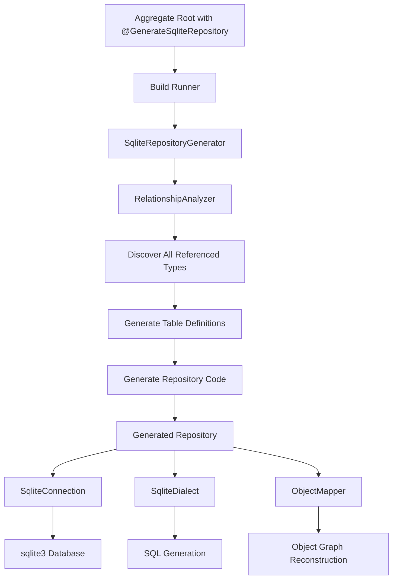

# Design Document

## Overview

This design specifies the implementation of a fully normalized SQL database repository system for DDDart aggregate roots through two complementary packages:

1. **dddart_repository_sql**: Base package providing ORM capabilities including schema generation, object graph traversal, relationship mapping, and SQL dialect support
2. **dddart_repository_sqlite**: Concrete SQLite implementation for local, mobile, desktop, and web applications

The design provides **full normalization** - every class (aggregate roots, entities, value objects) gets its own table with proper columns and foreign key relationships. This gives developers the full power of relational databases with SQL queries, joins, and indexes while maintaining DDD aggregate boundaries.

### Key Design Principles

- **Full Normalization**: Every class gets a table, every field gets a column
- **No JSON Blobs**: All data stored in proper SQL columns
- **Aggregate Boundaries**: Respect DDD aggregate boundaries with cascade deletes
- **Type Safety**: Compile-time code generation ensures type-safe operations
- **Relationship Mapping**: Automatic foreign key generation and JOIN handling
- **Value Object Handling**: Smart identity management for value objects
- **Transaction Integrity**: Multi-table operations wrapped in transactions

### Design Challenges and Solutions

**Challenge 1: Value Objects Don't Have Identity**
- **Solution**: Generate synthetic IDs for value objects in SQL
- Use content-based hashing to detect duplicates
- Option to share or duplicate value object rows

**Challenge 2: Complex Object Graphs**
- **Solution**: Recursive graph traversal during code generation
- Build dependency tree of all referenced types
- Generate tables in correct order (dependencies first)

**Challenge 3: Loading Aggregates Requires JOINs**
- **Solution**: Generate optimized JOIN queries
- Reconstruct object graph from flat result set
- Use LEFT JOINs for nullable relationships

**Challenge 4: Saving Requires Multi-Table Updates**
- **Solution**: Wrap all operations in transactions
- Topological sort for save order (dependencies first)
- Cascade deletes for aggregate boundaries

## Architecture

### Package Structure

```
packages/
├── dddart_repository_sql/          # Base ORM package
│   ├── lib/
│   │   ├── dddart_repository_sql.dart
│   │   └── src/
│   │       ├── annotations/
│   │       │   └── generate_sql_repository.dart
│   │       ├── connection/
│   │       │   └── sql_connection.dart
│   │       ├── dialect/
│   │       │   └── sql_dialect.dart
│   │       ├── schema/
│   │       │   ├── schema_generator.dart
│   │       │   ├── type_mapper.dart
│   │       │   ├── relationship_analyzer.dart
│   │       │   └── table_definition.dart
│   │       ├── query/
│   │       │   ├── query_builder.dart
│   │       │   └── join_builder.dart
│   │       ├── mapping/
│   │       │   ├── object_mapper.dart
│   │       │   └── graph_traverser.dart
│   │       └── exceptions/
│   │           └── sql_repository_exception.dart
│   ├── test/
│   └── pubspec.yaml
│
└── dddart_repository_sqlite/       # SQLite implementation
    ├── lib/
    │   ├── dddart_repository_sqlite.dart
    │   └── src/
    │       ├── annotations/
    │       │   └── generate_sqlite_repository.dart
    │       ├── connection/
    │       │   └── sqlite_connection.dart
    │       ├── dialect/
    │       │   └── sqlite_dialect.dart
    │       └── generators/
    │           └── sqlite_repository_generator.dart
    ├── build.yaml
    ├── test/
    ├── example/
    └── pubspec.yaml
```

### Component Interaction



## Components and Interfaces

### Base Package Components

#### RelationshipAnalyzer

```dart
/// Analyzes aggregate root classes to discover all referenced types.
class RelationshipAnalyzer {
  /// Discovers all types referenced by an aggregate root.
  /// Returns a dependency-ordered list of types.
  List<ClassElement> analyzeAggregate(ClassElement aggregateRoot);
  
  /// Determines the relationship type between two classes.
  RelationshipType getRelationshipType(FieldElement field);
  
  /// Checks if a type is a value object (no identity).
  bool isValueObject(ClassElement element);
  
  /// Checks if a type is an entity (has identity).
  bool isEntity(ClassElement element);
}

enum RelationshipType {
  oneToOne,      // Single reference
  oneToMany,     // List<T>
  manyToOne,     // Reference from child to parent
}
```

#### TableDefinition

```dart
/// Represents a SQL table definition for a class.
class TableDefinition {
  TableDefinition({
    required this.tableName,
    required this.className,
    required this.columns,
    required this.foreignKeys,
    required this.isAggregateRoot,
  });
  
  final String tableName;
  final String className;
  final List<ColumnDefinition> columns;
  final List<ForeignKeyDefinition> foreignKeys;
  final bool isAggregateRoot;
  
  /// Generates CREATE TABLE SQL statement.
  String toCreateTableSql(SqlDialect dialect);
}

class ColumnDefinition {
  ColumnDefinition({
    required this.name,
    required this.sqlType,
    required this.dartType,
    required this.isNullable,
    required this.isPrimaryKey,
    required this.isForeignKey,
  });
  
  final String name;
  final String sqlType;
  final String dartType;
  final bool isNullable;
  final bool isPrimaryKey;
  final bool isForeignKey;
}

class ForeignKeyDefinition {
  ForeignKeyDefinition({
    required this.columnName,
    required this.referencedTable,
    required this.referencedColumn,
    required this.onDelete,
  });
  
  final String columnName;
  final String referencedTable;
  final String referencedColumn;
  final CascadeAction onDelete;
}

enum CascadeAction {
  cascade,    // DELETE CASCADE for entities within aggregate
  setNull,    // SET NULL for optional references
  restrict,   // RESTRICT for references to other aggregates
}
```

#### ObjectMapper

```dart
/// Maps between domain objects and SQL rows.
class ObjectMapper {
  /// Serializes an object graph to SQL rows.
  /// Returns a map of table names to rows to insert/update.
  /// Value objects are flattened into parent rows with prefixed columns.
  Map<String, List<Map<String, Object?>>> serializeGraph(
    Object aggregateRoot,
    Map<Type, TableDefinition> schema,
  );
  
  /// Deserializes SQL rows to an object graph.
  /// Reconstructs value objects from prefixed columns.
  T deserializeGraph<T>(
    Map<String, List<Map<String, Object?>>> rows,
    Map<Type, TableDefinition> schema,
  );
  
  /// Flattens a value object into prefixed key-value pairs.
  Map<String, Object?> flattenValueObject(String prefix, Object valueObject);
  
  /// Reconstructs a value object from prefixed columns.
  T reconstructValueObject<T>(String prefix, Map<String, Object?> row);
}
```

#### JoinBuilder

```dart
/// Builds SQL JOIN queries for loading aggregate graphs.
class JoinBuilder {
  /// Generates a SELECT query with JOINs for an aggregate root.
  String buildLoadQuery(
    TableDefinition rootTable,
    Map<Type, TableDefinition> schema,
    SqlDialect dialect,
  );
  
  /// Generates JOIN clauses for related tables.
  List<String> buildJoinClauses(
    TableDefinition table,
    Map<Type, TableDefinition> schema,
    SqlDialect dialect,
  );
}
```

### SQLite Package Components

#### SqliteRepositoryGenerator

The generator performs these steps:

1. **Validate** aggregate root class (extends AggregateRoot, has @Serializable)
2. **Analyze** object graph using RelationshipAnalyzer
3. **Generate** TableDefinitions for all discovered types
4. **Order** tables by dependencies (value objects first, then entities, then aggregate root)
5. **Generate** repository code with:
   - CREATE TABLE statements for all tables
   - INSERT/UPDATE logic for all tables
   - SELECT with JOINs for loading
   - DELETE with cascades
   - Transaction wrapping

#### Generated Repository Structure

```dart
/// Generated repository for Order aggregate (example).
class OrderSqliteRepository implements Repository<Order> {
  OrderSqliteRepository(this._connection);
  
  final SqliteConnection _connection;
  final _dialect = SqliteDialect();
  final _serializer = OrderJsonSerializer();
  final _mapper = ObjectMapper();
  
  @override
  Future<Order> getById(UuidValue id) async {
    return await _connection.transaction(() async {
      // Load from all related tables with JOINs
      final rows = await _loadOrderGraph(id);
      return _deserializeOrder(rows);
    });
  }
  
  @override
  Future<void> save(Order aggregate) async {
    await _connection.transaction(() async {
      // Save to all related tables in dependency order
      await _saveMoneyValues(aggregate);
      await _saveAddresses(aggregate);
      await _saveOrderItems(aggregate);
      await _saveOrder(aggregate);
    });
  }
  
  @override
  Future<void> deleteById(UuidValue id) async {
    await _connection.transaction(() async {
      // Cascade delete handles related tables
      await _connection.execute(
        'DELETE FROM orders WHERE id = ?',
        [_dialect.encodeUuid(id)],
      );
    });
  }
  
  Future<void> createTables() async {
    await _connection.transaction(() async {
      // Create tables in dependency order
      await _createMoneyTable();
      await _createAddressTable();
      await _createOrderItemsTable();
      await _createOrdersTable();
    });
  }
  
  // Private helper methods for each table...
}
```

## Data Models

### Table Generation Strategy

**For Each Class in Object Graph:**

1. **Analyze Fields**:
   - Primitive types → SQL columns
   - Value objects → Embedded columns with field name prefix
   - References to entities/aggregates → Foreign key columns
   - Lists of entities → Separate table with FK back to parent

2. **Determine Table Name**:
   - Aggregate roots: Use annotation or snake_case of class name
   - Entities: snake_case of class name (e.g., `order_items`)
   - Value objects: **No table** (embedded in parent)

3. **Generate Primary Key**:
   - Aggregate roots: Use existing `id` field
   - Entities: Generate synthetic `id` column
   - Value objects: **No primary key** (embedded)

4. **Generate Foreign Keys**:
   - Entity to parent (aggregate or entity): FK with CASCADE DELETE if within same aggregate
   - Aggregate to aggregate: **No FK** (just store UUID)
   - Value objects: **No FK** (embedded)

**Key Principle:** One table per entity class, regardless of which aggregate uses it. The same entity class used by multiple aggregates shares a single table.

### Example Schema Generation

**Domain Model:**

```dart
@Serializable()
@GenerateSqliteRepository()
class Order extends AggregateRoot {
  Order({
    required UuidValue id,
    required this.customerId,
    required this.totalAmount,
    required this.shippingAddress,
    required this.items,
  }) : super(id);
  
  final UuidValue customerId;  // Reference to Customer aggregate
  final Money totalAmount;     // Value object (embedded)
  final Address shippingAddress;  // Value object (embedded)
  final List<OrderItem> items;  // Entities within aggregate
}

class OrderItem {
  OrderItem({
    required this.productId,
    required this.quantity,
    required this.price,
  });
  
  final UuidValue productId;
  final int quantity;
  final Money price;  // Value object (embedded)
}

class Money {
  Money({required this.amount, required this.currency});
  final double amount;
  final String currency;
}

class Address {
  Address({required this.street, required this.city, required this.country});
  final String street;
  final String city;
  final String country;
}
```

**Generated SQL Schema:**

```sql
-- Entity table (one table per entity class)
-- Value objects are embedded as columns with prefixes
CREATE TABLE order_items (
  id BLOB PRIMARY KEY NOT NULL,  -- Generated synthetic ID
  order_id BLOB NOT NULL,  -- FK to parent aggregate
  productId BLOB NOT NULL,
  quantity INTEGER NOT NULL,
  price_amount REAL NOT NULL,      -- Embedded Money value object
  price_currency TEXT NOT NULL,    -- Embedded Money value object
  FOREIGN KEY (order_id) REFERENCES orders(id) ON DELETE CASCADE
);

-- Aggregate root table
-- Value objects are embedded as columns with prefixes
CREATE TABLE orders (
  id BLOB PRIMARY KEY NOT NULL,  -- From AggregateRoot
  createdAt INTEGER NOT NULL,
  updatedAt INTEGER NOT NULL,
  customerId BLOB NOT NULL,  -- Reference to another aggregate (no FK)
  totalAmount_amount REAL NOT NULL,      -- Embedded Money value object
  totalAmount_currency TEXT NOT NULL,    -- Embedded Money value object
  shippingAddress_street TEXT NOT NULL,  -- Embedded Address value object
  shippingAddress_city TEXT NOT NULL,    -- Embedded Address value object
  shippingAddress_country TEXT NOT NULL  -- Embedded Address value object
);
```

**Note:** If `OrderItem` class is used by multiple aggregates (e.g., `Order` and `Invoice`), they share the same `order_items` table. The `order_id` FK determines which aggregate owns each row.

### Type Mapping

| Dart Type | SQL Type | Notes |
|-----------|----------|-------|
| UuidValue | BLOB | 16 bytes |
| String | TEXT | UTF-8 |
| int | INTEGER | 64-bit |
| double | REAL | 64-bit float |
| bool | INTEGER | 0 or 1 |
| DateTime | INTEGER | Milliseconds since epoch |
| Enum | TEXT | Enum name as string |
| Custom class | BLOB (FK) | Foreign key to class table |
| List<T> | N/A | Separate table with FK back |
| T? (nullable) | Same + NULL | Allow NULL values |

### Foreign Key Strategy

**Within Aggregate Boundary:**
- Entity → Aggregate Root: `ON DELETE CASCADE`

**Across Aggregate Boundaries:**
- Aggregate → Aggregate: **NO FOREIGN KEY** (just store UUID)
- Rationale: Aggregates may be in different databases
- Referential integrity enforced by domain logic

**Value Objects:**
- **NO FOREIGN KEYS** - value objects are embedded as columns
- No separate tables, no identity, no references

### Value Object Embedding

**Strategy**: Value objects are flattened into the parent table with prefixed column names.

**Example:**
```dart
class Order {
  final Money totalAmount;  // Value object
}

class Money {
  final double amount;
  final String currency;
}
```

**Generated Columns:**
```sql
CREATE TABLE orders (
  id BLOB PRIMARY KEY,
  totalAmount_amount REAL NOT NULL,    -- Flattened from Money.amount
  totalAmount_currency TEXT NOT NULL   -- Flattened from Money.currency
);
```

**Benefits:**
- ✅ Simple schema - no extra tables
- ✅ No foreign keys needed
- ✅ No JOIN overhead
- ✅ Direct SQL queries: `WHERE totalAmount_amount > 100`
- ✅ Aligned with DDD - value objects have no identity
- ✅ No deduplication complexity

## Correctness Properties

*A property is a characteristic or behavior that should hold true across all valid executions of a system—essentially, a formal statement about what the system should do. Properties serve as the bridge between human-readable specifications and machine-verifiable correctness guarantees.*

### Property 1: Aggregate round trip preserves all fields

*For any* aggregate root with nested entities and value objects, saving and retrieving should return an aggregate with all fields equal to the original.

**Validates: Requirements 2.1, 2.2, 4.1, 4.3**

### Property 2: Nested entities are preserved

*For any* aggregate root containing a list of entities, the round-trip should preserve all entities with their field values and list order.

**Validates: Requirements 2.3, 2.4**

### Property 3: Value objects are preserved

*For any* aggregate root containing value objects, the round-trip should preserve all value object field values.

**Validates: Requirements 12.1, 12.2, 12.4**

### Property 4: Deleting aggregate cascades to entities

*For any* aggregate root with nested entities, deleting the aggregate should also delete all related entity rows from the database.

**Validates: Requirements 4.5**

### Property 6: Non-existent ID throws notFound

*For any* randomly generated UUID that has not been saved, calling getById should throw RepositoryException with type notFound.

**Validates: Requirements 4.2**

### Property 7: Update preserves relationships

*For any* aggregate root, modifying a nested entity's fields, saving, and retrieving should return the modified entity values.

**Validates: Requirements 4.4**

### Property 8: Concurrent saves maintain integrity

*For any* two aggregates saved concurrently in separate transactions, both should be fully persisted without partial writes or corruption.

**Validates: Requirements 4.3, 4.4**

### Property 9: UUID round trip

*For any* UuidValue stored as BLOB, retrieving and decoding should return an equivalent UuidValue.

**Validates: Requirements 10.1, 10.2**

### Property 10: DateTime precision preserved

*For any* DateTime value, the round-trip through storage should preserve the value within millisecond precision.

**Validates: Requirements 3.6**

### Property 11: Boolean values preserved

*For any* boolean field, the round-trip should return the exact same boolean value.

**Validates: Requirements 3.7**

## Error Handling

[Previous error handling section remains the same]

## Testing Strategy

### Unit Testing

**RelationshipAnalyzer Tests:**
- Test discovery of all referenced types
- Test dependency ordering
- Test detection of circular references
- Test value object vs entity classification

**ObjectMapper Tests:**
- Test serialization of simple aggregates
- Test serialization of nested entities
- Test serialization of value objects
- Test deserialization with JOINed data
- Test content-based ID generation

**SchemaGenerator Tests:**
- Test table generation for each type
- Test foreign key generation
- Test cascade delete rules
- Test UNIQUE constraints for value objects

**JoinBuilder Tests:**
- Test JOIN query generation
- Test LEFT JOIN for nullable references
- Test multi-level nesting

### Property-Based Testing

**Configuration:**
- Minimum 100 iterations per property
- Random aggregate generation with varied nesting
- Random value object generation
- Concurrent operation testing

**Test Implementation:**
```dart
// Feature: sql-repository, Property 1: Aggregate round trip preserves all fields
// Validates: Requirements 2.1, 2.2, 4.1, 4.3
test('aggregate round trip preserves all nested data', () async {
  for (var i = 0; i < 100; i++) {
    final order = generateRandomOrder();  // With items, addresses, money
    await orderRepo.save(order);
    final retrieved = await orderRepo.getById(order.id);
    
    expect(retrieved.customerId, equals(order.customerId));
    expect(retrieved.totalAmount.amount, equals(order.totalAmount.amount));
    expect(retrieved.items.length, equals(order.items.length));
    // ... verify all nested fields
  }
});
```

### Integration Testing

**Multi-Table Operations:**
- Test saving aggregates with deep nesting
- Test loading with complex JOINs
- Test cascade deletes
- Test value object deduplication
- Test transaction rollback on error

**Concurrent Access:**
- Test multiple repositories accessing same data
- Test transaction isolation
- Test deadlock prevention

## Implementation Notes

### Code Generation Complexity

The generator must:

1. **Discover Type Graph**: Recursively find all types referenced by aggregate
2. **Detect Cycles**: Handle circular references (e.g., A → B → A)
3. **Order Dependencies**: Topological sort for table creation order
4. **Generate Schema**: Create TableDefinition for each type
5. **Generate Queries**: Build INSERT, UPDATE, SELECT with JOINs, DELETE
6. **Generate Mapping**: Create serialization/deserialization logic
7. **Handle Edge Cases**: Nullable fields, empty lists, null references

### Transaction Management

All multi-table operations must be wrapped in transactions:

```dart
Future<void> save(Order aggregate) async {
  await _connection.transaction(() async {
    // All operations succeed or all fail
    await _saveValueObjects(aggregate);
    await _saveEntities(aggregate);
    await _saveAggregateRoot(aggregate);
  });
}
```

### Performance Considerations

**Loading:**
- Use single SELECT with JOINs instead of N+1 queries
- Use LEFT JOIN for nullable relationships
- Consider query result caching for value objects

**Saving:**
- Batch INSERT statements where possible
- Use INSERT OR REPLACE for value objects (upsert)
- Only update changed entities (future optimization)

**Indexing:**
- Primary keys automatically indexed
- Foreign keys should be indexed
- Consider indexes on frequently queried fields

### Migration Strategy

**Initial Release:**
- No migration support - manual schema management
- `createTables()` uses `CREATE TABLE IF NOT EXISTS`
- Schema changes require manual ALTER TABLE

**Future Enhancement:**
- Schema versioning
- Automatic migration generation
- Data transformation support

### SQLite Foreign Key Support

**Critical Implementation Detail:**

SQLite supports CASCADE DELETE and foreign key constraints, but they are **disabled by default** for backwards compatibility. The `SqliteConnection` must enable them when opening the database:

```dart
class SqliteConnection implements SqlConnection {
  Future<void> open() async {
    _database = sqlite3.open(_path);
    
    // CRITICAL: Enable foreign key constraints
    // Without this, CASCADE DELETE will not work!
    _database.execute('PRAGMA foreign_keys = ON');
  }
}
```

**Why This Matters:**
- Without `PRAGMA foreign_keys = ON`, foreign key constraints are ignored
- CASCADE DELETE will not work
- Orphaned rows will remain in child tables
- This is a common SQLite gotcha

**Testing:**
- Verify foreign keys are enabled: `PRAGMA foreign_keys;` should return 1
- Test cascade deletes work correctly
- Document this requirement clearly in README

### Platform Support

Same as previous design - `sqlite3` package works across all platforms.

## Future Enhancements

**Query DSL:**
- Type-safe query builder
- Support for WHERE, ORDER BY, LIMIT
- JOIN support for related aggregates

**Lazy Loading:**
- Load aggregate root without entities
- Load entities on-demand

**Change Tracking:**
- Track which fields changed
- Only UPDATE modified fields
- Optimize save performance

**MySQL/PostgreSQL:**
- Implement dialect-specific optimizations
- Use native UUID type in PostgreSQL
- Use BINARY(16) in MySQL
