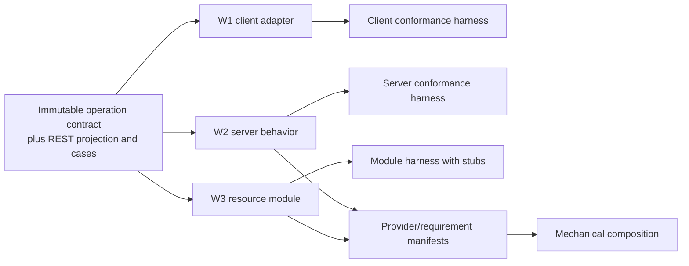
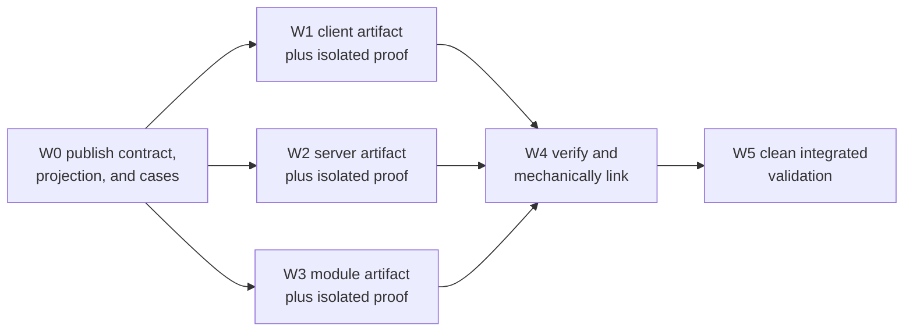

# dddart Agent-Native Architecture Proposal 001

> **Historical proposal.** This document was derived from the 2026-08-06
> Experiment 001 baseline. Its API sketches are proposals, not current framework
> contracts. Since it was written, `QueryableRepository`, `getAllItems`, and
> multi-serializer `CrudResource` have been removed and validation is driven by
> `tool/validation/inventory.json`.

Date: 2026-08-07
Status: architecture proposal; no framework changes implemented
Governing objective: **maximize safe independent change**

## 1. Executive Summary

Experiment 001 did not fail because dddart lacked enough files to divide among workers. It failed because the files did not sit behind one executable, reproducible agreement. The client, server, and composition workers could each write plausible code, but no worker possessed a machine-checkable statement of the operation's meaning, wire representation, result completeness, errors, or compatibility with the other artifacts.

The smallest coherent remedy is not one new interface. It is one narrow **operation-contract pipeline** with five connected capabilities:

1. A transport-neutral typed operation/query contract defines identity, input, result shape, pagination semantics, stable error codes, and canonical behavioral cases.
2. An explicit, declarative `RestQueryProjectionDefinition<I, O>` defines the legacy HTTP projection without putting HTTP into the domain contract. Publication derives its runtime adapters and projection digest.
3. Public behavioral ports—an `OperationExecutor` implemented by REST on the client and a typed operation-provider seam on the server—let W1 and W2 live in ordinary, independently testable libraries. Minimal can expose a repository-context compatibility façade over that behavior.
4. Resource modules declare typed operation requirements rather than importing W2's handler symbol. Machine-readable component manifests let a composition tool match providers to requirements and generate the final static Dart registry.
5. A canonical worker command prepares an isolated checkout, enforces the toolchain and lockfile, regenerates declared outputs, verifies that they compile, runs component-scoped gates, and emits a proof/artifact manifest.

The **properties** represented by these five pieces must hold together: executable agreement, public peer-free ports, disjoint mutable state, peer-free proof, and predeclared reproducible composition/lifecycle. The named mechanisms are not uniquely necessary—a frozen typed composition factory could replace manifests plus a linker—but each mechanism here addresses one observed dependency. A descriptor without a public executor leaves W1 coupled to generated internals. A public executor without canonical cases leaves W1 and W2 free to agree on the wrong protocol. Contract tests without hermetic generation inherit the shared-state failure. A typed handler without a predeclared W3 composition seam leaves W3 importing W2. Compatibility metadata without derived digests merely automates ambiguous wiring.

This proposal presents three alternatives:

- **Minimal:** add the operation pipeline alongside today's CRUD and generator architecture, preserve the existing GET representation through an explicit declarative REST projection, and retain current combined generated parts behind a deterministic preparation contract.
- **Moderate:** make operations a first-class package, adopt a standard query invocation protocol, move transport generation off aggregate declarations, emit ordinary generated libraries per concern, and resolve typed component contributions.
- **Radical:** make contracts and implementations independently versioned, content-addressed component artifacts built and linked by an application graph compiler.

The recommendation is **Moderate as the architectural direction, introduced through one narrow vertical slice**. Minimal is a useful control and migration bridge, but it deliberately retains the combined-part and dual-query architecture that caused several baseline collisions. Experiment 002 should implement only the Moderate foundations needed by one Product query: a handwritten neutral operation contract and canonical cases, an explicit compatibility REST projection, public executors, typed provider/requirement linkage, isolated unit manifests, and observable server lifecycle. It should not yet introduce a general IDL, migrate every generator, or replace existing CRUD. This tests the causal claim without making the temporary compatibility shape the long-term design.

On paper, all three alternatives can move W1, W2, and W3 to practical concurrency three. They differ primarily in migration cost, strength of isolation outside this feature, and how much new tooling becomes trusted infrastructure.

## 2. Baseline From Experiment 001

The baseline is [Agent Parallelism Experiment 001](../experiments/agent-parallelism-001-results.md). Its comparable metrics were:

| Metric | Experiment 001 baseline | Interpretation used here |
|---|---:|---|
| Total work items | 6 | Contract publication, W1 client, W2 server, W3 composition, integration, and final validation. |
| Theoretical concurrent workers | 3 | W1–W3 could begin authoring from an orchestrator-supplied contract. A finish-to-start reading of the validation edge gives conventional DAG width two. |
| Practical concurrent workers | 1 | Only W2 passed its declared worker-local static gate without another implementation or shared-state mutation. Under the study's stronger behavioral-proof requirement, the initial count was effectively zero. |
| Worker collisions | 5 | Contract/semantic, source-library, integration, build-state, and lifecycle collisions. |
| Undocumented cross-boundary assumptions | 9 | Wire encoding, pagination, result metadata, generated names and placement, build invocation, validation coverage, and related conventions. |
| Execution-affecting shared modification points | 2 | `product.dart` and generated/cache state. |
| Integration repairs | 2, plus 1 adaptation | Stale transport getter, generation reroute, and ephemeral-port workaround. |

### 2.1 Repository evidence behind the baseline

The price-range operation currently exists as disconnected declarations:

- The domain method is only `Future<List<Product>> findByPriceRange(double minPrice, double maxPrice)` in [product.dart](../../packages/dddart_repository_rest/example/lib/product.dart).
- The client independently chooses the `priceRange` key and comma-separated representation in the same file.
- The server independently parses that representation in [product_query_handler.dart](../../packages/dddart_repository_rest/example/lib/product_query_handler.dart).
- Composition repeats the string key and imports the concrete handler in [product_price_range_server_example.dart](../../packages/dddart_repository_rest/example/product_price_range_server_example.dart).

The current generator preserves a Dart method shape, not the meaning of the operation. `GenerateRestRepository` exposes only `resourcePath` and `implements` in [generate_rest_repository.dart](../../packages/dddart_repository_rest/lib/src/annotations/generate_rest_repository.dart). The generator discovers extra interface methods and emits abstract signatures in [rest_repository_generator.dart](../../packages/dddart_repository_rest/lib/src/generators/rest_repository_generator.dart), but it emits no operation identity, input codec, server parser, pagination policy, result metadata, stable error code, or conformance cases. Its signature formatter also flattens parameters to `type name`, losing named/optional structure.

The server seam is HTTP-shaped rather than operation-shaped. `QueryHandler<T>` receives `Map<String, String>`, positional `skip` and `take`, and `dynamic authResult` in [query_handler.dart](../../packages/dddart_rest/lib/src/query_handler.dart). `CrudResource` dispatches from a `Map<String, QueryHandler<T>>`, removes two reserved strings, and rejects more than one remaining key in [crud_resource.dart](../../packages/dddart_rest/lib/src/crud_resource.dart). Query authorization likewise receives raw query parameters in [authorization_handler.dart](../../packages/dddart_rest/lib/src/authorization_handler.dart).

The method signature cannot express the behavior the server already exposes. `QueryResult<T>` carries `totalCount`, while the domain method returns only a list. `CrudResource` defaults to 50 results and caps a request at 100. The current client sends no pagination and discards `X-Total-Count`. A future contract must choose one of two honest semantics: return `QueryPage<Product>`, or explicitly define a compatibility wrapper that collects pages or knowingly returns one page.

Error agreement is similarly accidental. The server maps `FormatException` to HTTP 400 in [error_mapper.dart](../../packages/dddart_rest/lib/src/error_mapper.dart), while the generated client maps 400 through its default branch to an unknown repository error in [rest_repository_generator.dart](../../packages/dddart_repository_rest/lib/src/generators/rest_repository_generator.dart). Stable problem codes are needed; status numbers and prose do not form an operation contract.

The existing generic serialization contract is not enough for operation envelopes. `Serializer<T>` serializes one object to a string in [serialization_contracts.dart](../../packages/dddart_serialization/lib/src/serialization_contracts.dart), while `ResponseBuilder.okList` accepts any serializer/content type and then unconditionally `jsonDecode`s every value before emitting JSON in [response_builder.dart](../../packages/dddart_rest/lib/src/response_builder.dart). Typed query inputs, pages, metadata, and problems need structured codecs independent of aggregate serialization.

### 2.2 Source and extension topology

The generated REST base is public, but `_connection`, `_resourcePath`, `_serializer`, and `_mapHttpException` are Dart library-private. Reusing those helpers requires the custom implementation to be in the same library. It does **not** require the same physical file: REST tests already place custom code in [test_models_impl.dart](../../packages/dddart_repository_rest/test/test_models_impl.dart) as a `part` of [test_models.dart](../../packages/dddart_repository_rest/test/test_models.dart). That improves line ownership but not library isolation: a part owns no imports and validates with every declaration and generated member in its parent library.

The issue is systemic. The external-library SQLite example explicitly says it cannot access generated “protected” members and substitutes an in-memory cache in [custom_user_repository_impl.dart](../../packages/dddart_repository_sqlite/example/lib/custom_user_repository_impl.dart). DynamoDB, MongoDB, MySQL, SQLite, and REST generators all use public bases around private backend context. A narrow behavioral context is a better seam than making individual raw connections, serializers, dialects, and error mappers public.

### 2.3 Proof is possible, but no shared oracle exists

Independent proof is closer than the baseline implementation made it appear:

- `RestConnection` already accepts an injected HTTP client in [rest_connection.dart](../../packages/dddart_repository_rest/lib/src/connection/rest_connection.dart), so a client adapter can be tested without a server.
- `CrudResource.handleQuery` is directly testable with a Shelf request, as existing tests demonstrate.
- The custom repository suite performs real-HTTP tests, but its client and server both handwrite the same query keys. It proves a copied protocol, not conformance to an independently published operation contract.

The missing capability is therefore not “more end-to-end tests.” It is a reusable contract kit with canonical cases that can act as an oracle for either side when the peer does not exist.

### 2.4 Build and validation topology

Several current choices prevent a worker checkout from being its own environment contract:

- The root [.gitignore](../../.gitignore) ignores both `pubspec.lock` and all `*.g.dart`, so dependency resolution and compile-critical combined parts are inherited local state unless regenerated.
- REST and JSON builders use `SharedPartBuilder` and the combining builder, converging on one generated part through [REST build.yaml](../../packages/dddart_repository_rest/build.yaml) and [JSON build.yaml](../../packages/dddart_json/build.yaml).
- Builder selectors in examples are inconsistent with declared builder IDs. The nested REST example also lacks the parent package's direct `source_gen` dependency, so its failure is a builder/combiner topology problem, not merely one misspelled selector.
- The root workspace lists the REST example in [pubspec.yaml](../../pubspec.yaml), while [scripts/test-all.sh](../../scripts/test-all.sh) and [.github/workflows/test.yml](../../.github/workflows/test.yml) maintain separate package lists that omit examples.
- The local script suppresses generation output and continues after a failed generation command, while CI fails generation. Neither derives its gates from workspace membership plus package metadata.
- `HttpServer.registerResource` appends untyped resources, `addRoute` accepts method/path strings and `Function`, and `start()` constructs a private router and private bound server in [http_server.dart](../../packages/dddart_rest/lib/src/http_server.dart). W3 has no in-memory composition artifact or exposed bound port to validate.

The package CI does run build_runner, analysis, and tests for the packages it lists; it is inaccurate to say dddart has no executable proof of combined generated code at all. The narrower failure is that proof is neither operation-specific nor reproducible for every workspace member, particularly the nested Product example. Generator unit/property tests that say “compiles” still inspect strings and brace counts rather than compiling their generated fixture in [generator_property_test.dart](../../packages/dddart_repository_rest/test/generator_property_test.dart).

### 2.5 What must change together

The evidence reduces the problem to four boundaries and one lifecycle:



All three workers also require the same machine-executable lifecycle: isolated checkout → enforced dependencies → deterministic generation → component gate → proof manifest → immutable artifact. This is a prerequisite, not a fourth feature worker.

## 3. Design Principles

1. **Publish contracts before dispatch.** W1–W3 may consume a contract but must not negotiate or edit it while their frontier is active. A contract change creates a new version and a new frontier.
2. **Separate semantics from transport.** `PriceRangeInput`, validation/inclusivity, pagination completeness, result metadata, and problem codes belong to a neutral operation contract. CSV query encoding, HTTP paths, headers, and status mappings belong to a REST projection.
3. **Make the contract executable in both directions.** Input/output codecs, validation, and literal canonical cases must be runnable. Documentation may explain the contract but cannot be its only representation.
4. **Do not test an adapter against itself.** Canonical requests, responses, and problems are materialized and digest-bound when the contract is published. Worker harnesses consume those read-only vectors rather than asking the production adapter to generate its own expected values.
5. **Expose behavior, not generator internals.** A public context should offer operations such as `query`, `get`, and error-normalized execution. It should not merely reveal an HTTP client, serializer, URI fragments, and private mapping functions one by one.
6. **Make required and provided capabilities explicit.** A resource module requires an operation key and derived neutral/projection digests; a handler provides them. Neither side imports the other's implementation.
7. **Generate central artifacts; never hand-edit them.** Static imports are necessary for Dart AOT. The integration tool may generate a registry, but it must be deterministic, duplicate-checked, and solely machine-owned.
8. **Treat build preparation as a versioned API.** SDK version, lockfile, builder identities, inputs, outputs, and validation gates are declared data. A warning plus a zero exit code is not success if a declared artifact is absent or unimportable.
9. **Separate four proof levels.** Static validity, local behavioral validity, contract conformance, and end-to-end integration answer different questions. Only the last may depend on peer artifacts.
10. **Keep central decisions central and visible.** Contract semantics, application inclusion, environment-specific providers, authorization policy, and version upgrades need owners. The resolver should automate wiring, not silently make product decisions.
11. **Optimize human ceremony through scaffolding.** Extra structure is justified only where it buys ownership or proof. A CLI should create contract, client, handler, module, tests, and manifests from one operation name.
12. **Prefer detectable incompatibility over permissive magic.** Missing providers, duplicate routes, incompatible digests, undeclared errors, absent generated outputs, and stale lockfiles should fail before the integration test runs.

## 4. Minimal Alternative

### 4.1 Architectural summary

The Minimal alternative adds an opt-in typed query path beside the current string-keyed custom-query path. It preserves existing CRUD APIs, the current Product aggregate annotation, the current GET endpoint, and the `SharedPartBuilder` pipeline. It changes only the seams that blocked W1–W3:

1. Add lightweight operation primitives and a transport-neutral `QueryContract`.
2. Add a separate declarative `RestQueryProjectionDefinition`; publication derives the client/server adapters and a `PublishedRestQueryProjection`.
3. Generate a public `RestRepositoryContext<T>` instead of requiring custom code to reuse private members.
4. Register typed operation providers and resource requirements; generate the final catalog rather than importing W2 from W3.
5. Add canonical contract cases and three component harnesses.
6. Add a manifest-driven worker runner that builds each worker in an isolated checkout and verifies generated outputs.
7. Expose a route plan and a bound-server handle so composition can be validated without fixed ports.

The legacy `queryHandlers` map and same-library subclass pattern remain available during migration. The new path is not a wrapper over those strings; it is a parallel typed route that can eventually replace them.

### 4.2 Concrete Dart API

The sketches below are intentionally handwritten. Generating them before their semantics survive Experiment 002 would turn generator output into the design authority too early.

```dart
final class OperationId {
  const OperationId(this.name, {required this.version});

  final String name;
  final int version;
}

final class PageRequest {
  const PageRequest({this.offset = 0, this.limit = 50});

  final int offset;
  final int limit;
}

final class QueryPage<T> {
  const QueryPage({
    required this.items,
    required this.totalCount,
    required this.page,
  });

  final List<T> items;
  final int totalCount;
  final PageRequest page;
}

extension type ProblemCode(String value) {}

abstract interface class DataSchema<T> {
  Object get canonicalDescription;
}

abstract interface class DataCodec<T> {
  Object? encode(T value);
  T decode(Object? data);
}

final class OrderingContract<T> {
  OrderingContract(Iterable<GeneratedOrderTerm<T>> terms)
      : terms = List.unmodifiable(terms);

  final List<GeneratedOrderTerm<T>> terms;

  Object get canonicalDescription => [
    for (final term in terms) term.canonicalDescription,
  ];

  int compare(T left, T right) => compareGeneratedTerms(terms, left, right);
}

abstract interface class QueryFilterDefinition<I, T> {
  Object get canonicalDescription;
}

final class QueryDefinition<I, T> {
  const QueryDefinition({
    required this.id,
    required this.input,
    required this.item,
    required this.pagination,
    required this.ordering,
    required this.filter,
    required this.allowedProblems,
    required this.cases,
  });

  final OperationId id;
  final DataSchema<I> input;
  final DataSchema<T> item;
  final PaginationContract pagination;
  final OrderingContract<T> ordering;
  final QueryFilterDefinition<I, T> filter;
  final Set<ProblemCode> allowedProblems;
  final List<QueryContractCase<I, T>> cases;
}

final class PublishedQuerySnapshot<I, T> {
  PublishedQuerySnapshot({
    required this.id,
    required this.pagination,
    required this.ordering,
    required this.filter,
    required Iterable<ProblemCode> allowedProblems,
    required Iterable<QueryContractCase<I, T>> cases,
  })  : allowedProblems = Set.unmodifiable(allowedProblems),
        cases = List.unmodifiable(cases);

  final OperationId id;
  final PaginationContract pagination;
  final OrderingContract<T> ordering;
  final QueryFilterDefinition<I, T> filter;
  final Set<ProblemCode> allowedProblems;
  final List<QueryContractCase<I, T>> cases;
}

abstract interface class PublishedQueryRuntime<I, T> {
  DataCodec<I> get inputCodec;
  DataCodec<T> get itemCodec;
  I validateAndNormalize(I input);
}

final class PublishedQueryContract<I, T> {
  const PublishedQueryContract({
    required this.snapshot,
    required this.runtime,
    required this.coreDigest,
    required this.casesDigest,
  });

  final PublishedQuerySnapshot<I, T> snapshot;
  final PublishedQueryRuntime<I, T> runtime;
  final String coreDigest;
  final String casesDigest;
}
```

`PageRequest` is a serializable request value, not the validator. `PaginationContract.normalize` rejects negative offsets and non-positive limits, supplies the default, and applies the declared maximum before any handler runs. Both client and server adapters invoke the same rule, and canonical cases prove the rejection/normalization behavior.

`PriceRangeInput` is an unchecked serializable DTO. Its finite/ordered constraints and the inclusive Product-price filter are declarative schema nodes; the published runtime is the single validation authority. Fixed contract cases contain canonical products with fixed identifiers and timestamps, invalid inputs, expected pages, and problem codes.

```dart
final class PriceRangeInput {
  const PriceRangeInput({required this.min, required this.max});

  final double min;
  final double max;
}

final productPriceThenIdOrdering = OrderingContract<Product>([
  ProductContractFields.price.ascending(),
  ProductContractFields.id.ascending(),
]);

final findProductsByPriceDefinition = QueryDefinition<PriceRangeInput, Product>(
  id: const OperationId(
    'products.find-by-price-range',
    version: 1,
  ),
  input: PriceRangeInputSchema(
    rules: const [FiniteFields(['min', 'max']), LessThanOrEqual('min', 'max')],
  ),
  item: ProductContractSchema(),
  pagination: const PaginationContract(
    defaultLimit: 50,
    maximumLimit: 100,
    totalCount: ResultMetadata.required,
  ),
  ordering: productPriceThenIdOrdering,
  filter: ProductContractFields.price.inClosedRange(
    lower: PriceRangeInputContractFields.min,
    upper: PriceRangeInputContractFields.max,
  ),
  allowedProblems: const {
    ProblemCode('invalid-price-range'),
    ProblemCode('invalid-page'),
    ProblemCode('invalid-request'),
    ProblemCode('unauthorized'),
    ProblemCode('forbidden'),
  },
  cases: productPriceRangeCases,
);

// Generated by the contract publisher; never handwritten.
final findProductsByPrice = PublishedQueryContract<PriceRangeInput, Product>(
  snapshot: generatedFindProductsByPriceSnapshot,
  runtime: generatedFindProductsByPriceRuntime,
  coreDigest: 'sha256:<derived-neutral-contract-digest>',
  casesDigest: 'sha256:<derived-literal-cases-digest>',
);
```

The unpublished definition contains no user-supplied fingerprint or executable codec/validation callback. V1 accepts declarative `DataSchema`, rule, filter, pagination, and ordering values and derives `generatedFindProductsByPriceRuntime`. `ProductContractFields` is generated from that same canonical Product schema; field descriptors supply canonical order/filter terms and executable accessors, avoiding behavior separate from its hashed description. Publication canonicalizes the author definition into `generatedFindProductsByPriceSnapshot`, which deep-copies collections into unmodifiable generated records; runtime adapters never retain the mutable author object. It then emits the runtime and digests. A future custom-code escape hatch must bind a publisher-computed source/artifact digest explicitly. The REST projection digest is computed afterward from the neutral digest plus its mapping, so transport metadata cannot participate in or create a cycle with the neutral identity.

The legacy CSV protocol cannot be derived from the neutral declaration. Minimal therefore makes it explicit in a separate REST projection rather than pretending it is domain meaning:

```dart
final productPriceRangeRestDefinition = RestQueryProjectionDefinition<
    PriceRangeInput,
    Product>(
  contract: findProductsByPrice,
  method: RestMethod.get,
  resourcePath: '/products',
  input: RestQueryRecord([
    RestCsvTupleField.two(
      key: 'priceRange',
      first: PriceRangeInputContractFields.min,
      second: PriceRangeInputContractFields.max,
      scalar: RestDoubleLexical.v1,
      separator: ',',
    ),
  ]),
  page: const RestPageBinding(
    items: RestBodyShape.jsonArray,
    totalCountHeader: 'X-Total-Count',
  ),
  problems: const RestProblemBinding.rfc7807(),
);

// Generated from the declarative mapping and literal wire cases.
final productPriceRangeRest = PublishedRestQueryProjection<PriceRangeInput, Product>(
  snapshot: generatedProductPriceRangeRestSnapshot,
  runtime: generatedProductPriceRangeRestRuntime,
  projectionDigest: 'sha256:<derived-rest-projection-digest>',
);
```

The mapping definition is handwritten, but it contains no arbitrary encoder closure: field descriptors, tuple grammar, numeric lexical form, page/header mapping, and problem schema all have canonical descriptions. Publication emits a deep immutable projection snapshot and derives the runtime encoder/decoder from it; it does not retain the mutable definition. The projection digest covers the neutral core digest, canonical mapping, and independently authored literal wire cases. If a compatibility projection requires custom code that cannot be described this way, its generated/source artifact digest must become an explicit projection input rather than pretending the mapping is unchanged.

The client generator exposes one behavioral context. It does not make each private helper public:

```dart
abstract interface class RestRepositoryContext<T extends AggregateRoot> {
  Future<QueryPage<T>> queryPage<I>(
    PublishedRestQueryProjection<I, T> binding,
    I input, {
    PageRequest page = const PageRequest(),
  });

  Future<List<T>> queryAll<I>(
    PublishedRestQueryProjection<I, T> binding,
    I input,
  );
}

abstract class ProductRestRepositoryBase implements ProductRepository {
  ProductRestRepositoryBase(
    RestConnection connection, {
    RestRepositoryContext<Product>? context,
  }) : rest = context ?? generatedProductRestContext(connection);

  final RestRepositoryContext<Product> rest;
}
```

W1 can now be an ordinary library with an injected fake context. The existing list-returning method gets explicit “collect all pages” semantics rather than silently returning at most 50 items:

```dart
abstract base class ProductRestRepositoryWithPriceRange
    extends ProductRestRepositoryBase {
  ProductRestRepositoryWithPriceRange(super.connection, {super.context});

  @override
  Future<List<Product>> findByPriceRange(double min, double max) {
    return rest.queryAll(
      productPriceRangeRest,
      PriceRangeInput(min: min, max: max),
    );
  }
}
```

The class is abstract only because the repository's existing `findByCategory` method is outside this sketch; it supplies a complete implementation of the price-range capability without pretending that unrelated custom methods vanished. A concrete application repository implements or mixes in the other capabilities. The Experiment 002 fixture intentionally declares only the price-range compatibility method, so its W1 façade is concrete.

W2 provides a typed handler. Parsing, pagination validation, page-envelope encoding, and problem mapping are framework adapters around the handler, not repeated inside it:

```dart
final productPriceRangeProvider = productPriceRangeRest.bindServer(
  (
    Repository<Product> repository,
    PriceRangeInput range,
    PageRequest page,
    OperationContext<void> context,
  ) async {
    final products = await getAllItems<Product>(
      repository,
      operationName: findProductsByPrice.snapshot.id.name,
    );
    final matches = products
        .where((product) =>
            range.min <= product.price && product.price <= range.max)
        .toList()
      ..sort(findProductsByPrice.snapshot.ordering.compare);

    return QueryPage(
      items: matches.skip(page.offset).take(page.limit).toList(),
      totalCount: matches.length,
      page: page,
    );
  },
);
```

W3 declares a requirement, not a concrete handler import:

```dart
final productResourceModule = RestResourceModule<Product, void>(
  id: 'product-resource',
  path: '/products',
  repository: productRepository,
  serializers: {'application/json': ProductJsonSerializer()},
  requiredQueries: [
    OperationRequirement(findProductsByPrice),
  ],
);

final application = DddartApplicationSpec(
  modules: [productResourceModule],
);
```

For local proof, W3 links `productResourceModule` with a generated reference provider made from the canonical cases. At final integration, the linker supplies W2's provider.

The HTTP lifecycle becomes two-phase:

```dart
final plan = DddartApplication.compose(modules, contributions);
plan.validate(); // no socket: types, digests, routes, duplicates, requirements

final running = await plan.serve(
  address: InternetAddress.loopbackIPv4,
  port: 0,
  shared: false,
);
addTearDown(running.close); // idempotent
final origin = running.origin;
```

### 4.3 Proposed source and module layout

```text
packages/dddart_repository_rest/example/lib/
  product.dart                              # aggregate, interface, annotations, part
  contracts/
    product_price_range.dart                # W0 neutral contract and fixed cases
    product_price_range_rest.dart           # W0 REST projection
  client/
    product_rest_repository.dart            # W1 ordinary library
  server/
    product_price_range_provider.dart       # W2 ordinary library
  modules/
    product_resource_module.dart            # W3 ordinary library
  generated/
    product_components.g.dart               # integration-owned, not worker-edited
  product.g.dart                            # current combined generated part

.dddart/components/
  product-price-range.contract.json
  product-rest-client.component.json
  product-price-range-server.component.json
  product-resource.component.json

dddart.worker.yaml
```

Keeping `product.dart` and its combined generated part is the principal compromise. W1 no longer lives there, W2 never imports W1, and W3 never imports W2. The generated part is a read-only prepared dependency for all three rather than a mutable worker artifact.

### 4.4 Generated and handwritten artifacts

| Artifact | Handwritten or generated | Owner |
|---|---|---|
| `PriceRangeInput`, neutral query definition, canonical semantic cases | Handwritten and reviewed | Contract owner before dispatch |
| Declarative REST projection definition for the existing GET/CSV protocol | Handwritten initially; runtime codecs generated | Contract owner before dispatch |
| Contract canonical JSON and derived digests | Generated deterministically | Contract compiler |
| Public REST repository context implementation | Generated by the existing repository generator | Framework/generator |
| Client repository method | Handwritten | W1 |
| Typed server behavior | Handwritten | W2 |
| Resource module/application spec | Handwritten | W3 |
| Client/server reference fixtures | Generated from frozen canonical cases, then treated as immutable worker inputs | Contract compiler |
| Component manifests | Generated from typed declarations, with optional checked-in review form | Component compiler |
| Final import/catalog source | Generated, sorted, and disposable | Integration linker |
| Existing Product JSON/REST combined part | Regenerated in each isolated worker sandbox | Canonical preparation tool |

### 4.5 Machine-readable metadata

Every contract and component receives canonical metadata. A server contribution would contain at least:

```json
{
  "schema": "dddart.component/v1",
  "id": "product-price-range-server",
  "entrypoint": "package:dddart_repository_rest_example/server/product_price_range_provider.dart#productPriceRangeProvider",
  "provides": [
    {
      "kind": "query-operation",
      "id": "products.find-by-price-range",
      "version": 1,
      "coreContractDigest": "sha256:...",
      "restProjectionDigest": "sha256:..."
    }
  ],
  "requires": [
    {"kind": "repository", "aggregate": "Product"}
  ]
}
```

The W3 manifest lists the same operation under `requires` and lists normalized routes. W1 lists the contract and published REST projection as consumed inputs. The linker rejects mismatched identities, versions, or digests before it emits Dart imports.

A decentralized `dddart.worker.yaml` is present in every workspace member and is discovered from the root workspace, not another manually maintained array. It declares toolchain, lockfile, generator owner/cwd, inputs, expected outputs, smoke imports, component gates, and allowed capabilities. Commands are represented as validated argv arrays or known gate kinds; worker artifacts cannot introduce arbitrary executable commands.

### 4.6 Worker ownership boundaries

| Worker | Read-only inputs | Owned outputs | Must not know |
|---|---|---|---|
| W1 client | Product public model/interface, neutral contract, published REST projection, public context, canonical client cases | `client/product_rest_repository.dart` and its focused tests | W2 handler source, repository filtering algorithm, W3 module source |
| W2 server | Product model, neutral contract, published REST projection, server adapter API, seeded canonical cases | `server/product_price_range_provider.dart` and its focused tests | Client repository implementation, URI-building internals, W3 module source |
| W3 composition | Product resource description, operation requirement and reference provider, public route-plan API | `modules/product_resource_module.dart` and module tests | W1 implementation, W2 provider symbol or algorithm, generated final catalog internals |

The contract and binding are frozen W0 artifacts. None of W1–W3 may edit them. A required semantic change invalidates the frontier and starts a new contract version.

### 4.7 Worker validation model

Each worker runs the same four named levels, but only levels relevant to the component are enabled:

1. **Static:** focused analysis and formatting over the owned source closure.
2. **Local behavior:** worker-authored tests of branching or business logic.
3. **Contract conformance:** framework harness against immutable canonical vectors.
4. **Integration:** deliberately unavailable as a completion requirement for W1–W3.

W1's harness uses a recording HTTP client and canonical responses/problems. It proves domain input → exact request, multi-page collection, page/header decoding, and stable problem mapping without W2.

W2's harness invokes the published REST projection with canonical Shelf requests and a seeded `InMemoryRepository`. It proves decoding, validation, inclusive boundaries, pagination, metadata, and error encoding without W1.

W3's harness composes the module with generated reference providers. It proves required operation identities/digests, normalized routes, duplicate detection, auth/repository/serializer requirements, and an in-memory Shelf handler without W2 or a socket.

Framework-owned tests separately prove the generic REST context, projection adapters, reference-provider generator, manifest encoder, and linker. This prevents each feature worker from re-proving framework machinery.

### 4.8 Integration flow

1. Verify W1–W3 artifact manifests against the same base revision, toolchain digest, neutral contract digest, and REST projection digest.
2. Reject overlapping owned paths or writes outside declared ownership.
3. Match each W3 operation requirement with exactly one provider. Reject missing or duplicate providers.
4. Normalize and reject duplicate HTTP method/path pairs and duplicate operation IDs.
5. Generate sorted explicit imports and `product_components.g.dart`; Dart AOT needs this static step.
6. Compile the generated composition root.
7. Build a route plan and validate it without binding a socket.
8. Run the real-HTTP test on loopback port 0 using the observed `running.origin`.
9. Run final regression gates from the same unit manifests used locally.

The integrator may select an application/deployment spec supplied by W3, but it may not choose protocol fields, handlers, route-conflict winners, contract versions, or error semantics. Multiple eligible providers are an error unless the application spec explicitly selects one.

### 4.9 Compatibility and migration cost

Compatibility is high:

- `Repository<T>`, aggregates, serializers, `CrudResource`, `RestConnection`, and existing CRUD endpoints remain.
- Old same-library subclasses and `queryHandlers` maps remain supported for a deprecation period.
- The legacy GET/CSV route remains because the explicit REST projection describes it.
- Generated base constructors can accept the new public context while retaining `super.connection` construction.
- `HttpServer.start/stop` can delegate to the new plan/bound-handle API before deprecation.

Migration is operation-by-operation. The primary source break is optional: existing list-returning methods may delegate to `queryAll`; new APIs should expose `QueryPage<T>` directly when metadata matters.

Repository work is still non-trivial: add the contract primitives, shared lightweight REST-binding library, public context, typed registration path, harnesses, manifests/runner/linker, bound-server handle, committed workspace lock, and corrected builder topology. “Minimal” means minimal coherent architecture, not a one-file patch.

### 4.10 Human developer ergonomics

For a human, the common path should be:

```sh
dart run dddart create query products.find-by-price-range \
  --input PriceRangeInput --item Product --rest=get
```

The scaffold creates the contract, declarative projection, client/server/module stubs, canonical-case template, tests, and component declarations. The developer supplies semantic cases and the server algorithm. Existing method-call ergonomics remain. Error messages use operation IDs and owned files, not builder phase names.

The cost is visible additional structure for one query. It is justified because the files correspond to distinct owners and proof boundaries. Small applications may colocate the files in folders within one package; package-per-operation is not required.

### 4.11 Expected effect on Experiment 001

On paper, W1–W3 can start after W0, modify disjoint ordinary files, run behavioral and conformance gates without peers, and emit compatible component artifacts. W3 no longer waits for W2 to compile. W1 no longer compiles unrelated custom client methods in the Product library. Generated Product code is prepared independently in each sandbox and verified before the task starts. Integration is a deterministic link-and-test operation.

The practical concurrency prediction is therefore three, subject to Experiment 002 proving that the context, harnesses, worker runner, and linker are not themselves coupled through hidden state.

### 4.12 Major risks

- The old and new query APIs coexist; behavior may drift if legacy strings remain indefinitely.
- The explicit REST projection is a second contract artifact. Neutral and projection version/digest policies must remain coherent.
- The existing combined `product.g.dart` still couples JSON and REST generator health, even though workers no longer modify it.
- Handwritten codecs and canonical cases can be wrong or incomplete.
- A generic `RestRepositoryContext` can become a dumping ground. Its surface must remain behavioral.
- The worker runner and linker become trusted tooling and need their own adversarial tests.
- `queryAll` may be expensive. The contract must state limits/cancellation and should prefer page-returning new APIs.

### 4.13 Unresolved questions

- Should neutral contract primitives live in `dddart` or a small `dddart_query` package?
- Which lightweight package should own REST projection definitions so client and server avoid a heavy or cyclic dependency?
- Are canonical cases sufficient for v1, or must the contract also support property generators?
- Which compatibility changes require a neutral version bump, a projection version bump, or both?
- How long should string-keyed query registration remain supported?
- Should generated outputs remain local derived state or should application-level outputs be committed? This proposal chooses isolated regeneration for Experiment 002.

## 5. Moderate Alternative

### 5.1 Architectural summary

The Moderate alternative treats custom operations—not repository subclasses—as the primary extensibility model. It introduces a small `dddart_operations` kernel and transport adapter packages. A query is a typed operation with a stable identity, input/output/problem schemas, pagination, canonical cases, and derived compatibility digests. REST is one generated projection of that operation.

The model also changes physical generation:

- Transport annotations move off aggregate declarations and onto infrastructure specifications.
- JSON, repository, and operation generators emit separate ordinary Dart libraries instead of fragments combined into the aggregate library.
- Client, server, and module implementations consume public operation APIs; none needs a generated base's private state.
- Component contributions and application requirements are first-class, and a deterministic linker emits the AOT-compatible composition root.
- Hermetic unit manifests, isolated generation, proof artifacts, and route-plan validation are required rather than optional tooling around the architecture.

Unlike Minimal, Moderate adopts a standard query invocation protocol for new operations. Legacy GET endpoints can be exposed through compatibility projections, but a new query needs no handwritten transport encoder/decoder.

### 5.2 Concrete Dart API

The neutral kernel is general enough for queries and commands but is deliberately not a workflow engine:

```dart
final class OperationKey<I, O, E> {
  const OperationKey(this.id, {required this.version});

  final String id;
  final int version;
}

abstract interface class OperationSchema<T> implements DataSchema<T> {
  List<CanonicalRule> get rules;
}

sealed class OperationSemantics {
  const OperationSemantics();
  Object get canonicalDescription;
}

final class QuerySemantics<I, T> extends OperationSemantics {
  const QuerySemantics({
    required this.pagination,
    required this.ordering,
    required this.filter,
    required this.completeness,
  });

  final PaginationContract pagination;
  final OrderingContract<T> ordering;
  final QueryFilterDefinition<I, T> filter;
  final ResultCompleteness completeness;

  @override
  Object get canonicalDescription => {
    'pagination': pagination.canonicalDescription,
    'ordering': ordering.canonicalDescription,
    'filter': filter.canonicalDescription,
    'completeness': completeness.name,
  };
}

final class OperationDefinition<I, O, E> {
  const OperationDefinition({
    required this.key,
    required this.input,
    required this.output,
    required this.problems,
    required this.semantics,
    required this.cases,
  });

  final OperationKey<I, O, E> key;
  final OperationSchema<I> input;
  final OperationSchema<O> output;
  final ProblemSchema<E> problems;
  final OperationSemantics semantics;
  final List<OperationCase<I, O, E>> cases;
}

abstract interface class PublishedOperationRuntime<I, O, E> {
  DataCodec<I> get inputCodec;
  DataCodec<O> get outputCodec;
  DataCodec<E> get problemCodec;
  OperationOutcome<I, E> validateAndNormalize(I input);
}

final class PublishedOperationSnapshot<I, O, E> {
  PublishedOperationSnapshot({
    required this.key,
    required this.semantics,
    required Iterable<OperationCase<I, O, E>> cases,
  }) : cases = List.unmodifiable(cases);

  final OperationKey<I, O, E> key;
  final OperationSemantics semantics;
  final List<OperationCase<I, O, E>> cases;
}

final class PublishedOperationContract<I, O, E> {
  const PublishedOperationContract({
    required this.snapshot,
    required this.runtime,
    required this.coreDigest,
    required this.casesDigest,
  });

  final PublishedOperationSnapshot<I, O, E> snapshot;
  final PublishedOperationRuntime<I, O, E> runtime;
  final String coreDigest;
  final String casesDigest;
}

sealed class OperationOutcome<O, E> {
  const OperationOutcome();
}

final class OperationSuccess<O, E> extends OperationOutcome<O, E> {
  const OperationSuccess(this.value);
  final O value;
}

final class OperationRejected<O, E> extends OperationOutcome<O, E> {
  const OperationRejected(this.problem);
  final E problem;
}

abstract interface class OperationHandler<I, O, E, C> {
  Future<OperationOutcome<O, E>> call(
    I input,
    OperationContext<C> context,
  );
}

abstract interface class OperationExecutor {
  Future<OperationOutcome<O, E>> invoke<I, O, E>(
    PublishedOperationContract<I, O, E> contract,
    I input,
  );
}
```

The Product query makes paging and typed problems primary instead of leaking them through headers and generic repository exceptions:

```dart
final class PriceRangeInput {
  const PriceRangeInput({required this.min, required this.max});

  final double min;
  final double max;
}

final class PriceRangeQuery {
  const PriceRangeQuery({required this.range, required this.page});

  // An unchecked serializable DTO. PriceRangeQuerySchema performs validation
  // and returns a typed ProductQueryProblem before the handler is called.
  final PriceRangeInput range;
  final PageRequest page;
}

sealed class ProductQueryProblem {
  const ProductQueryProblem(this.code);
  final ProblemCode code;
}

final findProductsByPriceDefinition = OperationDefinition<
    PriceRangeQuery,
    QueryPage<Product>,
    ProductQueryProblem>(
  key: const OperationKey(
    'products.find-by-price-range',
    version: 1,
  ),
  input: PriceRangeQuerySchema(),
  output: ProductPageSchema(),
  problems: ProductQueryProblemSchema(),
  semantics: QuerySemantics<PriceRangeQuery, Product>(
    pagination: const PaginationContract(
      defaultLimit: 50,
      maximumLimit: 100,
      totalCount: ResultMetadata.required,
    ),
    ordering: productPriceThenIdOrdering,
    filter: ProductContractFields.price.inClosedRange(
      lower: PriceRangeQueryContractFields.rangeMin,
      upper: PriceRangeQueryContractFields.rangeMax,
    ),
    completeness: ResultCompleteness.completePage,
  ),
  cases: productPriceRangeCases,
);

// Generated by publication from canonical definition data.
final findProductsByPrice = PublishedOperationContract<
    PriceRangeQuery,
    QueryPage<Product>,
    ProductQueryProblem>(
  snapshot: generatedFindProductsByPriceSnapshot,
  runtime: generatedFindProductsByPriceRuntime,
  coreDigest: 'sha256:<derived-neutral-contract-digest>',
  casesDigest: 'sha256:<derived-literal-cases-digest>',
);
```

The schemas and rules are declarative; publication derives a deeply immutable `generatedFindProductsByPriceSnapshot` rather than retaining the author definition or its mutable lists, and derives `generatedFindProductsByPriceRuntime`, including codecs, validation/problem mapping, and pagination normalization. The invocation pipeline uses those published artifacts before calling W2. Thus malformed input becomes `OperationRejected<ProductQueryProblem>` rather than an exception escaping around `OperationOutcome`, and neither post-publication mutation nor a handwritten validator can change behavior under an unchanged digest.

The generic REST adapter derives one protocol for every new query:

```text
POST /products/_queries/find-by-price-range@1
Content-Type: application/json

{
  "input": {
    "range": {"min": 10.0, "max": 20.0},
    "page": {"offset": 0, "limit": 50}
  }
}
```

```json
{
  "result": {
    "items": [],
    "page": {"offset": 0, "limit": 50},
    "totalCount": 0
  }
}
```

Problems use a stable code and typed details in a consistent envelope. REST status is a projection of the problem category, not its identity.

The runtime client is no longer a generated repository subclass with raw HTTP helpers:

```dart
final class ProductQueriesClient {
  const ProductQueriesClient(this._operations);

  final OperationExecutor _operations;

  Future<OperationOutcome<QueryPage<Product>, ProductQueryProblem>>
      findByPriceRange(PriceRangeQuery input) {
    return _operations.invoke(findProductsByPrice, input);
  }
}
```

An ergonomic repository façade may adapt this to an existing domain interface, but the operation client owns transport execution. The generated REST executor accepts an injected transport, structured codecs, authentication provider, and problem mapper through public interfaces.

W2 implements only domain behavior:

```dart
final class FindProductsByPriceHandler implements OperationHandler<
    PriceRangeQuery,
    QueryPage<Product>,
    ProductQueryProblem,
    ProductClaims> {
  const FindProductsByPriceHandler(this.products);

  final QueryableRepository<Product> products;

  @override
  Future<OperationOutcome<QueryPage<Product>, ProductQueryProblem>> call(
    PriceRangeQuery input,
    OperationContext<ProductClaims> context,
  ) async {
    final all = await products.getAll();
    final semantics = findProductsByPrice.snapshot.semantics
        as QuerySemantics<PriceRangeQuery, Product>;
    final matches = all
        .where((product) =>
            input.range.min <= product.price &&
            product.price <= input.range.max)
        .toList()
      ..sort(semantics.ordering.compare);
    final page = input.page;

    return OperationSuccess(
      QueryPage(
        items: matches.skip(page.offset).take(page.limit).toList(),
        totalCount: matches.length,
        page: page,
      ),
    );
  }
}
```

Transport generation is declared in an ordinary infrastructure-owned specification outside the aggregate:

```dart
final productRestResource = RestResourceAdapterSpec(
  aggregate: Product,
  resourceId: 'products',
  path: '/products',
  operations: [findProductsByPrice],
);
```

The component compiler evaluates this explicit entrypoint; it is not a Dart annotation requiring compile-time-constant arguments. Import direction is one-way: infrastructure imports the domain and published operation, generated adapters import those public declarations, and neither domain nor operation code imports transport or generated libraries.

Composition uses typed contributions:

```dart
final class ProductQueryRequirements {
  const ProductQueryRequirements({required this.products});
  final QueryableRepository<Product> products;
}

final productPriceRangeContribution = OperationProviderFactory(
  contract: findProductsByPrice,
  requires: const [
    QueryableRepositoryRequirement<Product>(),
  ],
  create: (ProductQueryRequirements requirements) =>
      FindProductsByPriceHandler(requirements.products),
);

final productModule = ResourceModule(
  resource: productResourceContract,
  requires: [OperationRequirement(findProductsByPrice)],
);
```

### 5.3 Proposed source and module layout

```text
lib/
  domain/
    product.dart
    product_repository.dart
  operations/
    price_range.dart
    find_products_by_price.dart
    find_products_by_price.cases.dart
  infrastructure/
    rest/
      product_rest_resource.dart
    client/
      product_repository.dart              # W1 façade, if domain API retained
    server/
      find_products_by_price_handler.dart   # W2
  modules/
    product_module.dart                     # W3
  generated/
    product.json.g.dart
    product.repository_rest.g.dart
    find_products_by_price.contract.g.dart
    find_products_by_price.rest.g.dart
    application_components.g.dart           # integration-only output

.dddart/
  contracts/
    products.find-by-price-range.v1.json
  components/
    product-client.json
    product-price-range-provider.json
    product-module.json

dddart.worker.yaml
```

Each generated library has one concern and imports public types. There is no `part of` relationship between aggregate, serializer, REST repository, and operation adapter. Importing the Product model does not compile a custom REST client implementation.

### 5.4 Generated and handwritten artifacts

| Artifact | Handwritten or generated | Rationale |
|---|---|---|
| Domain model and optional repository façade | Handwritten | Domain language remains readable. |
| Operation input/problem types | Handwritten, with schema annotations or explicit schemas | Semantics need review. |
| Operation contract and canonical cases | Handwritten | They are the independently authored oracle. |
| Canonical schemas, codecs, derived digests, fixed wire vectors | Generated | Repetitive and must be deterministic. |
| Standard REST client/server adapters | Generated from the operation and resource specifications | One framework protocol, no per-operation wire code. |
| Client domain façade | Handwritten or generated if it is a direct operation call | Preserves human-facing API without hiding semantics. |
| Server handler | Handwritten | Domain behavior is the worker's value. |
| Resource/application module | Handwritten | Deployment inclusion and dependencies remain deliberate. |
| Component manifests and final registry | Generated | Machine-owned compatibility and AOT composition. |

The contract compiler materializes canonical vectors before W1–W3 dispatch. Runtime adapters never generate their own expected fixtures.

### 5.5 Machine-readable metadata

Moderate promotes operation metadata to a stable schema:

```json
{
  "schema": "dddart.operation/v1",
  "id": "products.find-by-price-range",
  "version": 1,
  "coreContractDigest": "sha256:...",
  "inputSchemaDigest": "sha256:...",
  "outputSchemaDigest": "sha256:...",
  "problemSchemaDigest": "sha256:...",
  "pagination": {
    "kind": "offset-limit",
    "defaultLimit": 50,
    "maximumLimit": 100,
    "totalCount": "required"
  },
  "ordering": [
    {"field": "price", "direction": "ascending"},
    {"field": "id", "direction": "ascending"}
  ],
  "projections": {
    "dddart.rest.standard-query/v1": "sha256:..."
  },
  "casesDigest": "sha256:..."
}
```

`coreContractDigest` covers only neutral identity, schemas, declared semantics, and semantic cases. Each value under `projections` covers that core digest plus one transport mapping and its literal wire cases. An optional bundle digest hashes the core plus sorted projection digests. `casesDigest` is retained as a diagnostic sub-digest, not an independently mutable identity.

Component manifests add `provides`, `requires`, normalized routes, public Dart entrypoints, ownership roots, and validation gate IDs. Worker artifacts add base revision, environment digest, change digest, proof attestations, and exact write set.

The workspace lock is committed. A workspace-level toolchain declaration pins the Dart SDK used by workers and CI. Per-unit manifests are discovered from root workspace membership; omitted or explicitly disabled units are reported as policy decisions.

### 5.6 Worker ownership boundaries

| Worker | Read-only contracts | Owned outputs | Explicit non-knowledge |
|---|---|---|---|
| W1 | Operation artifact, generated REST client adapter, Product public codec, `OperationExecutor`, immutable conformance suite | Client façade and supplementary local tests | W2 handler, server repository algorithm, W3 module |
| W2 | Operation artifact, generated server adapter/harness, repository capability, Product public model, immutable conformance suite | Handler and supplementary local tests | REST request construction, W1 façade, W3 module |
| W3 | Resource and operation requirements, reference contributions, application-plan API, immutable module suite | Product module/application spec and supplementary local tests | W1 source, W2 source/symbol, generated linker internals |

Generated files are produced in each worker's sandbox from the same frozen contract inputs. No worker commits generator cache or edits the integration registry.

### 5.7 Worker validation model

Moderate makes the proof ladder a framework concept:

```dart
enum ProofLevel {
  staticValidity,
  localBehavior,
  contractConformance,
  integratedBehavior,
}
```

The unit manifest associates each component with required proof levels. W1 and W2 must pass the first three; W3 must pass static, local module behavior, and requirement/route conformance. Their artifact manifests record evidence digests and environment digests.

- W1 uses the generated reference REST endpoint and fixed wire vectors.
- W2 uses the generated in-process operation driver, canonical seeded data, and problem vectors.
- W3 uses a generated `ReferenceContributionCatalog` and route-plan validator.

The generic standard REST adapter is tested once by the framework with property and golden cases. Feature workers test only their mapping and semantics. End-to-end HTTP remains the integration gate.

### 5.8 Integration flow

The linker receives an application spec plus digest-bound worker artifacts:

1. Validate base revision, toolchain, lockfile, unit manifest, and exact neutral/projection digests.
2. Validate owned-path disjointness and declared write sets.
3. Resolve every operation/resource/repository/auth requirement to exactly one selected provider.
4. Reject missing providers, duplicates, dependency cycles, incompatible schema/projection versions, and duplicate normalized routes.
5. Generate sorted static Dart imports and a typed `OperationCatalog`.
6. Compile the catalog and application plan.
7. Run plan validation without sockets.
8. Serve on loopback port 0 with `shared: false`, consume the observed origin, and run real-HTTP cases.
9. Re-run clean generation and component/final gates from manifests.

Central decisions remain explicit in the application spec: included modules, production repository implementation, serializer/content types, authentication/authorization policy, environment configuration, and selection among intentional provider variants. The linker never resolves an ambiguity by precedence or file order.

### 5.9 Compatibility and migration cost

Migration cost is medium to high:

- Existing CRUD and domain base types can remain unchanged.
- Existing custom repository interfaces can receive generated compatibility façades over operation clients.
- Existing GET query endpoints can coexist through explicit legacy projections while new clients use the standard protocol.
- `CrudResource.queryHandlers` can adapt typed providers during migration.
- Existing generated `*RepositoryBase` subclasses need compatibility shims or gradual replacement.
- Moving annotations off aggregates and replacing combined parts requires generator work and import migrations.

The change should be introduced for custom REST operations first. Converting every persistence generator or existing CRUD endpoint before Experiment 002 would create cost without testing the hypothesis.

### 5.10 Human developer ergonomics

Humans author an operation, cases, and behavior—not URI parsing, JSON envelopes, status maps, or registry entries. The generated façade retains familiar calls:

```dart
final outcome = await products.findByPriceRange(
  PriceRangeQuery(
    range: const PriceRangeInput(min: 10, max: 20),
    page: const PageRequest(limit: 25),
  ),
);
```

The additional concepts—operation identity, page, typed problem, module requirement—are visible because they are real product semantics. Scaffolding and IDE navigation must connect generated façade, contract, handler, and cases. Generated sources are ordinary libraries with readable import paths, making diagnostics less mysterious than a combined part.

### 5.11 Expected effect on Experiment 001

W1–W3 consume the same immutable operation artifact and standard REST projection. W1 tests against a generated reference endpoint; W2 tests through a generated operation driver; W3 tests with reference contributions. Their sources, generated outputs, caches, and proof manifests are isolated. The linker can compose them without a protocol decision or source edit.

Practical concurrency is predicted to equal theoretical concurrency at three. Compared with Minimal, this result depends less on legacy Product-library health and handwritten compatibility-projection correctness.

### 5.12 Major risks

- The operation kernel, schema compiler, REST adapter, runner, and linker become a significant trusted computing base.
- Generated client and server adapters can share a common-mode defect; independent canonical vectors and reference interpreters are essential.
- A standard POST query protocol may be undesirable for caches, browser links, or existing REST conventions.
- Ordinary generated libraries require public construction/serialization seams from domain models.
- Moving existing generators risks broad migration churn and temporary dual architectures.
- Generic operation abstractions can obscure domain language if every method becomes an untyped “execute.” Generated typed façades must remain first-class.
- Component manifests and contract versioning introduce governance work.

### 5.13 Unresolved questions

- Should the standard protocol use POST envelopes, a structured GET convention, or support both under one versioned projection?
- How are schema-compatible but behavior-changing contract revisions classified?
- Should problem types be Dart sealed classes, data schemas, or both?
- What public construction contract must aggregates expose to ordinary generated serializers?
- How are authorization requirements represented without coupling the neutral contract to a claims implementation?
- Should component manifests be generated beside source or packaged only in worker artifacts?
- Which persistence backends should eventually implement the generic operation executor, and which should remain backend-specific?

## 6. Radical Alternative

### 6.1 Architectural summary

The Radical alternative starts with independently publishable contracts and components rather than a source repository containing mutually aware layers. A feature contract is an immutable, content-addressed artifact. Client adapters, server behaviors, resource modules, repository providers, and applications are components that declare typed capabilities against exact contract artifacts. A graph compiler resolves an application from those declarations, verifies proofs and compatibility, and generates a normal statically imported Dart program.

The unit of ownership is therefore a component, normally a small Dart package or a tool-created virtual package with its own dependency and generation boundary. Aggregates carry no transport or persistence annotations. There are no generated repository subclasses and no shared `part` files. Code generation consumes published contract/resource artifacts and emits ordinary libraries into the consuming component. The build system treats a component's source, toolchain, dependencies, generated outputs, proofs, and metadata as one immutable artifact.

This is not runtime plugin discovery. Dart AOT still receives explicit imports and typed construction code. The radical change is that those imports are derived from a checked graph rather than handwritten registrations or workspace scans.

### 6.2 Concrete Dart API

A contract package authors domain-facing Dart types and an executable declaration. A restricted contract compiler executes the declaration in an isolated preparation step and emits canonical schemas, cases, codecs, and a digest:

```dart
const findProductsByPrice = QueryDefinition<
    PriceRangeQuery,
    QueryPage<Product>,
    ProductQueryProblem>(
  key: OperationKey('products.find-by-price-range', version: 1),
  input: PriceRangeQuerySchema(),
  output: ProductPageSchema(),
  problems: ProductQueryProblemSchema(),
  semantics: QuerySemantics(
    filter: ProductContractFields.price.inClosedRange(
      lower: PriceRangeQueryContractFields.rangeMin,
      upper: PriceRangeQueryContractFields.rangeMax,
    ),
    ordering: OrderingSemantics.by([
      ProductContractFields.price.ascending(),
      ProductContractFields.id.ascending(),
    ]),
    pagination: OffsetPagination(
      defaultLimit: 50,
      maximumLimit: 100,
      totalCount: ResultMetadata.required,
    ),
    completeness: ResultCompleteness.completePage,
  ),
  cases: productPriceRangeCases,
);
```

After publication, workers import a generated immutable contract handle rather than rebuilding its identity from local source:

```dart
import 'package:find_products_by_price_contract/contract.dart';

// Generated from the published artifact.
const ContractRef<PriceRangeQuery, QueryPage<Product>, ProductQueryProblem>
    findProductsByPriceRef = ContractRef(
  id: 'products.find-by-price-range@1',
  digest: 'sha256:4bb1...',
);
```

Transport projections are separate artifacts. New REST queries use the standard projection; a legacy projection can coexist and has its own digest:

```dart
const productQueryRest = RestProjection(
  contract: findProductsByPriceRef,
  protocol: StandardRestQuery.v1,
  mount: ResourceMount('/products'),
);

const legacyProductQueryRest = RestProjection.compatibility(
  contract: findProductsByPriceRef,
  method: RestMethod.get,
  route: '/products',
  queryCodec: PriceRangeCsvQueryCodec(key: 'priceRange'),
  pageCodec: LegacySkipTakeCodec(),
);
```

A component provides or requires typed capabilities. Construction dependencies are named data, not service-locator lookups:

```dart
final class FindProductsByPriceComponent extends Component<
    FindProductsByPriceRequirements,
    FindProductsByPriceCapabilities> {
  const FindProductsByPriceComponent();

  @override
  FindProductsByPriceCapabilities build(
    FindProductsByPriceRequirements requirements,
  ) {
    return FindProductsByPriceCapabilities(
      provider: OperationProvider(
        contract: findProductsByPriceRef,
        handler: FindProductsByPriceHandler(requirements.products),
      ),
    );
  }
}
```

The source generator creates the concrete requirements/capabilities records and manifest from public declarations. W3 requires the contract capability, not the component class:

```dart
const productHttpModule = HttpModuleComponent(
  id: ComponentId('product-http'),
  mount: ResourceMount('/products'),
  resources: [productResourceRef],
  requires: [
    CapabilityRequirement.operation(findProductsByPriceRef),
  ],
);
```

An application author makes the remaining central choices in an explicit graph specification:

```dart
const productionApp = ApplicationGraph(
  roots: [productHttpModuleRef],
  selections: {
    productRepositoryCapability: postgresProductRepositoryRef,
    authenticationCapability: jwtAuthenticationRef,
  },
  policies: ApplicationPolicies(
    duplicateCapability: DuplicatePolicy.reject,
    undeclaredRoute: UndeclaredPolicy.reject,
  ),
);
```

`dddart graph compile` resolves exact artifact digests and emits a typed `main.g.dart`. The runtime has no reflection or graph ambiguity.

### 6.3 Proposed source and module layout

```text
components/
  product-domain/                         # plain model and repository capability
  find-products-by-price-contract/        # types, declaration, cases
  find-products-by-price-rest/            # transport projection artifact
  product-query-client/                   # W1
  find-products-by-price-provider/        # W2
  product-http-module/                    # W3
  postgres-product-repository/            # deployment provider
apps/
  product-service/
    application.graph.dart                # central selections
    generated/main.g.dart                 # graph-compiler output

.dddart/artifacts/                         # local content-addressed materialization
  sha256-4bb1.../artifact.json
dddart.workspace.yaml                      # toolchain and component roots
```

Each component has a `component.yaml`, `pubspec.yaml`, `lib/`, and `test/`, whether represented as a physical package or a CLI-managed virtual package. Separate package resolution is optional; separate declared input/output closure is not. Generated files are local to one component and never combine declarations from two components.

### 6.4 Generated and handwritten artifacts

| Artifact | Handwritten or generated | Owner |
|---|---|---|
| Domain types and repository capability | Handwritten | Domain owner |
| Operation definition and semantic cases | Handwritten | Contract owner |
| Canonical schema, codecs, wire vectors, digest, compatibility report | Generated and published immutably | Contract compiler |
| REST projection artifacts and reference interpreters | Generated for standard protocols; explicit declaration for compatibility protocols | Transport compiler |
| W1 façade policy and W2 domain behavior | Handwritten | Respective workers |
| Client/server transport mechanics | Generated ordinary libraries | Component-local generator |
| W3 module intent and application provider selections | Handwritten | Module/application owners |
| Requirements/capabilities records, component manifests, proof attestations | Generated | Component compiler/runner |
| Lock graph, static imports, construction code, route catalog | Generated | Graph compiler |

The only generated file imported by more than one component is already part of an immutable published contract package. No worker writes it.

### 6.5 Machine-readable metadata

Every artifact has a canonical envelope:

```json
{
  "schema": "dddart.artifact/v1",
  "kind": "component",
  "id": "find-products-by-price-provider",
  "digest": "sha256:...",
  "sourceDigest": "sha256:...",
  "contractInputs": ["sha256:4bb1..."],
  "toolchain": {"dart": "3.9.4", "compiler": "sha256:..."},
  "dependencies": [{"id": "product-domain", "digest": "sha256:..."}],
  "provides": [{"capability": "operation:products.find-by-price-range@1", "digest": "sha256:..."}],
  "requires": [{"capability": "repository:Product", "range": "1"}],
  "routes": [],
  "ownedPaths": ["lib/**", "test/**", "component.yaml"],
  "proofs": [
    {"level": "contract-conformance", "suite": "sha256:...", "evidence": "sha256:..."}
  ],
  "provenance": {"baseRevision": "...", "runner": "sha256:..."}
}
```

The digest covers canonical metadata plus declared sources and outputs. The graph lock records every selected artifact and transitive digest. Compatibility is checked against schema and protocol rules; a matching name without a compatible digest is never sufficient.

### 6.6 Worker ownership boundaries

| Worker | Immutable inputs | Artifact owned | Must not know |
|---|---|---|---|
| W1 | Product domain artifact, operation artifact, REST projection, reference endpoint | `product-query-client` component | W2 component identity/source, server repository, W3 module |
| W2 | Product domain artifact, operation artifact, reference driver, repository capability | `find-products-by-price-provider` component | REST encoding mechanics, W1 source, W3 module |
| W3 | Product resource artifact, operation capability requirement, reference provider | `product-http-module` component | W1 or W2 symbols, algorithm, graph-generated imports |

The artifact store is append-only during a frontier. Workers publish new digests; they do not mutate shared files or a common builder cache. The application owner selects artifacts after the frontier closes.

### 6.7 Worker validation model

Contract publication produces two independently implemented reference interpreters: a semantic model over canonical in-memory data and transport fixtures materialized as literal bytes. W1 tests requests and responses against the reference REST endpoint. W2 tests outcomes against the semantic model. W3 graph-compiles against a reference operation capability. Each runner starts from a clean materialization and emits evidence bound to source, contract, toolchain, and suite digests.

The four proof levels remain explicit. Radical adds an artifact-admissibility gate: a component cannot enter an application graph unless all proof levels required by its capability policy are present and reproducible. Common-mode generator failures are addressed by golden byte fixtures, a separately maintained reference interpreter, and fault-injection tests of the graph compiler.

### 6.8 Integration flow

1. Materialize the application graph and exact artifact lock in a new sandbox.
2. Verify every content digest, provenance statement, proof requirement, and toolchain identity.
3. Resolve typed capabilities; reject missing, duplicate, cyclic, incompatible, or unselected variants.
4. Compute the normalized route and dependency graph; reject conflicts and undeclared effects.
5. Generate typed records, static imports, construction order, route catalog, and `main.g.dart`.
6. Compile from only the graph lock and artifact store. Network resolution is disabled.
7. Validate the application plan, then run it on loopback port 0 and execute end-to-end contract cases.
8. Publish the application artifact and its transitive provenance graph.

The graph compiler can wire only declared compatibility. Humans still decide which components belong in an application, which environment provider is selected, authorization policy, secrets/configuration sources, and whether a contract upgrade is accepted.

### 6.9 Compatibility and migration cost

Compatibility is intentionally low and migration cost is very high. Existing domain models and repository interfaces can be wrapped, but annotation-bearing aggregate libraries, generated base subclasses, combined parts, string query registration, and handwritten composition roots are not the target model. A strangler migration could expose old CRUD resources as legacy components while new features use artifacts, but the repository would operate two build and composition systems for a substantial period.

This alternative requires a contract compiler, component compiler, artifact store, hermetic runner, compatibility engine, graph compiler, reference runtimes, and CLI before it feels usable. It is implementable in Dart—everything ultimately becomes packages, generated source, and normal static compilation—but it is not a proportionate first response to Experiment 001.

### 6.10 Human developer ergonomics

Without tooling, package/component proliferation would be intolerable. The CLI must make a component feel like one conceptual unit:

```sh
dddart new query products.find-by-price-range --resource products
dddart component test product-query-client
dddart graph explain product-service --why operation:products.find-by-price-range@1
```

Editors should show contract, implementation, tests, and generated adapters as one virtual feature. Diagnostics must identify a capability, expected/provided digest, provider candidates, and remediation. Humans gain reproducible examples and safe upgrades, but pay a real governance cost: contracts and component boundaries become product decisions rather than informal code organization.

### 6.11 Expected effect on Experiment 001

W1–W3 receive immutable, independently materialized artifacts and produce three content-addressed components. They share no writable source tree, generated file, cache, or registry. Each proves its capability against a reference implementation. Integration is graph resolution and compilation, so practical concurrency is predicted to equal theoretical concurrency at three with the lowest collision risk of the alternatives.

The prediction depends on a large amount of pre-existing platform capability. If that platform work is counted as feature preparation rather than framework infrastructure, Radical performs worse than Minimal or Moderate for early features.

### 6.12 Major risks

- The build/graph platform is large enough to become a framework within the framework.
- Content-addressed identity can create a false sense of semantic compatibility; behavioral version policy remains difficult.
- Reference interpreters and production generators may still share defects.
- Small changes can cause artifact and dependency churn unless compatibility ranges are disciplined.
- Package/component proliferation can slow analysis and confuse navigation.
- Provenance and proof metadata add storage, signing, and retention concerns.
- Debugging generated application graphs may be harder than debugging a handwritten root.
- Two architectures during migration could reduce, rather than improve, near-term independent change.

### 6.13 Unresolved questions

- Is Dart code the long-term contract source, or is a restricted language needed for portable canonicalization?
- What is the minimum semantic compatibility rule that is stronger than schema compatibility?
- Are components physical packages, virtual packages, or both, and how does the analyzer present them?
- Who is permitted to publish or supersede a contract artifact?
- Must proof attestations be signed, or are local digests sufficient for the intended threat model?
- How are secrets and environment configuration modeled without entering content-addressed artifacts?
- Can the artifact store and graph compiler remain fast enough for ordinary edit-test loops?
- How are cross-operation transactions and streaming operations represented without recreating a distributed workflow engine?

## 7. Side-by-Side Comparison

| Dimension | Minimal | Moderate | Radical |
|---|---|---|---|
| Primary unit | Existing repository plus opt-in typed query | Typed operation and component contribution | Immutable contract/component artifact |
| Neutral semantics | `QueryContract` plus cases | General `OperationContract` plus cases | Published, content-addressed contract artifact |
| REST representation | Explicit per-operation legacy binding | Generated standard protocol; explicit legacy projection | Separately versioned transport artifact |
| Client extension | Public generated `RestRepositoryContext` | Public `OperationExecutor` and typed façade | Generated component-local operation port |
| Server extension | Typed provider beside `CrudResource` | Transport-neutral `OperationHandler` | Capability-providing component |
| W3 dependency | Typed requirement plus generated catalog | Typed contribution/requirement graph | Artifact capability reference |
| Physical isolation | Ordinary worker files; existing combined part remains | Separate concerns and ordinary generated libraries | Component/package boundary and append-only artifact store |
| Build isolation | Manifested isolated checkout; current generators | Manifested component generation with committed lock | Hermetic artifact build and transitive graph lock |
| Independent proof | Canonical vectors and client/server/module harnesses | Generated reference adapters and proof ladder | Admissible proof attestations bound to artifact digests |
| Integration | Verify manifests, generate registry, plan, E2E | Resolve contributions, generate typed catalog, plan, E2E | Resolve graph, verify provenance, compile immutable application artifact |
| Legacy compatibility | High | Medium | Low |
| Migration cost | Medium | Medium-high | Very high |
| Human ceremony without tooling | Moderate | Moderate-high | Prohibitive |
| New trusted infrastructure | Contract kit, runner, linker | Operation/schema tooling, runner, linker | Compiler/artifact/provenance platform |
| Predicted W1–W3 practical concurrency | 3 | 3 | 3 |
| Long-term collision reduction | Partial | Strong | Strongest |

### 7.1 Capability comparison

The six **required properties** below are conjunctive at the outcome level; the listed APIs, manifests, harnesses, and linker are replaceable mechanisms for realizing them.

| Required capability | Minimal | Moderate | Radical |
|---|---|---|---|
| Executable cross-boundary contract | Added per query | First-class operation kernel | Independently published artifact |
| Public independent extension surface | REST behavioral context | Transport-neutral executor/handler | Typed component ports |
| Physically disjoint worker output | Yes for feature code; not all generated source | Yes for source and generated concerns | Yes by component artifact |
| Hermetic machine-executable build contract | Added around current build_runner topology | Native unit/component manifest | Foundational artifact-build rule |
| Proof without peer implementation | Canonical fixtures/reference providers | Generated reference adapters | Artifact-bound reference interpreters |
| Mechanical integration | Component manifest and generated registry | Typed linker and catalog | Application graph compiler |

### 7.2 What one declaration can and cannot drive

A transport-neutral declaration can define operation identity, typed arguments, validation, inclusivity, page/result shape, metadata, stable problems, semantic cases, and the public client/server types. It cannot uniquely derive the existing `priceRange=min,max` GET representation: CSV versus repeated fields versus JSON is a transport policy. The publishable unit should therefore be a **contract bundle** containing a neutral contract plus one or more separately identified transport projections. Identity follows a non-circular Merkle order: derive the neutral core digest first, derive each projection from that core, then optionally derive a bundle from the core and sorted projection digests.

| Concern from the study | Authoritative source | Derived consumer |
|---|---|---|
| Domain arguments and operation identity | Neutral input type and operation key | Typed façade and handler signatures |
| Validation and inclusive/exclusive meaning | Input schema/value type plus canonical semantic cases | Client pre-validation, handler reference driver, generated documentation |
| Pagination, result shape and metadata | Neutral output/page schema and semantics | Client page loop, server slicing/envelope, conformance cases |
| Error semantics | Typed problem schema and stable codes | Client outcome/exception mapping and server status/problem projection |
| Transport encoding and parsing | Versioned REST projection | Generic/generated client encoder and server decoder |
| Client and server adaptation | Contract plus projection | Public executor/provider adapters |
| Contract tests | Independently authored literal cases in the published bundle | Client, server, module and E2E harnesses |

Moderate's standard projection removes handwritten per-operation transport code, but it remains a versioned projection rather than hidden domain meaning. Radical publishes each projection as a separate artifact. This separation is what permits another transport to reuse the operation without inheriting HTTP vocabulary.

### 7.3 Physical-isolation consequences

| Structural change | Worker enabled/collision removed | New coordination point | Human cost and mitigation |
|---|---|---|---|
| Put W1 behind a public executor in an ordinary library | W1 no longer edits or compiles the aggregate/generated-part library; removes source-library and private-helper collision | Version the executor and contract ports | One façade file; scaffold direct delegations |
| Make W3 declare requirements instead of importing W2 | W3 validates before W2 exists; removes W2→W3 source/timing edge | Provider and requirement identities must be published by W0 | Generated typed requirement and reference-provider test |
| Generate the final registry as one W4-owned file | W1–W3 never edit a central registration map; removes integration merge surface | Application spec centrally selects intentional variants | Linker owns deterministic imports; humans review the plan |
| Move transport declarations off aggregates in Moderate | Domain and infrastructure changes no longer collide; operation workers avoid unrelated generated members | Resource spec becomes an explicit infrastructure-owned artifact | CLI generates resource specs and navigable links |
| Emit ordinary generated libraries per concern in Moderate | JSON, repository, client and server work get disjoint output/import closures; removes combined-part/cache coupling | Public model construction/codec contracts must be stable | Generator and IDE hide repetitive imports; diagnostics name the concern |
| Give every unit a discovered manifest and isolated cache | All workers reproduce their own preparation; removes inherited state and working-directory assumptions | Manifest schema/toolchain policy is central framework infrastructure | One generated manifest per unit and one canonical command |
| Use component/package artifacts in Radical | All frontier source, dependency and generated state is isolated | Contract/component publication and graph selection become formal gates | Virtual components, scaffolding and graph-explanation tooling are mandatory |

These separations add coordination only where a real central decision already exists: contract publication, application inclusion/provider choice, or toolchain policy. They remove accidental coordination through file placement, private symbols, cache history, and import timing.

### 7.4 Decision assessment

Minimal has the lowest protocol and migration risk, but its compatibility choices are also its ceiling. It continues to depend on a prepared combined Product library, preserves two custom-query models, and requires a handwritten declarative REST projection for each nonstandard operation. It is appropriate as an experimental control or bridge, not the cleanest strategic destination.

Moderate removes the source topology and extensibility choices that actively oppose independent work while preserving dddart's useful domain and repository concepts. It introduces substantial machinery, but each piece corresponds to an observed collision: operation artifacts address semantic collision, ordinary generated libraries address library/build collision, proof harnesses address peer dependence, and typed contributions address integration reconciliation.

Radical offers the strongest isolation and provenance, but most of its incremental benefit over Moderate appears only at multi-repository or artifact-supply-chain scale. Experiment 001 supplies no evidence that dddart yet needs an artifact marketplace, signing model, or fully content-addressed component graph. Building those first would make the experiment test a new platform rather than the architectural cause.

## 8. Paper Re-run of Experiment 001

### 8.1 Comparison rules and frozen feature semantics

This re-run assumes each alternative's framework capability already exists. Implementing the framework itself is not hidden inside a feature worker; its cost is compared in Sections 7 and 9 and becomes explicit preparation in Experiment 002. The feature uses the same six work items as the baseline:

1. W0 publishes the operation contract and transport projection.
2. W1 implements the client-side behavior.
3. W2 implements the server-side behavior.
4. W3 implements the resource/application module.
5. W4 mechanically integrates the three artifacts.
6. W5 performs final clean validation and records metrics.

W0 freezes the semantics that Experiment 001 left open: both prices must be finite, the range is inclusive, `min <= max`, results sort by price and then stable Product identity, offset pagination defaults to 50 and normalizes requests above 100 to 100, negative offsets and non-positive limits are invalid, `totalCount` is required, the compatibility list method collects all pages, and invalid inputs have stable problem codes. Canonical products, requests, pages, and problems are literal published cases. Alternative-specific transport projections are also frozen before dispatch.

The work graph is the same for all three alternatives:



The maximum concurrent implementation frontier is W1–W3, so theoretical concurrency remains three. Contract compilation, generation, manifest verification, and graph compilation are machine gates, not extra autonomous feature workers. A contract-publication owner is a natural additional role, but it is W0 and must finish before the frontier. A separate integration worker is W4. Splitting either into more workers would not increase the W1–W3 frontier and would obscure the comparison.

In all three reruns, worker-owned tests are supplementary. The conformance cases and authoritative client/server/module/E2E entrypoints are W0/framework artifacts frozen outside worker write roots, and the trusted integrator replays them. A worker cannot pass by weakening its own test.

The predictions use the baseline definitions. A collision is an execution-affecting semantic, source, integration, build-state, or lifecycle conflict between workers—not a detected invalid artifact. A shared modification point is a path or mutable state that more than one frontier worker must write. An integration repair is a source or design change made by W4; rejecting an incompatible artifact is a useful failure, not a repair.

### 8.2 Minimal paper re-run

The feature retains the legacy GET route. W0 publishes `findProductsByPrice`, `productPriceRangeRest`, canonical cases, their digests, and a prepared Product generated-source closure.

| Worker | Responsibility | Contracts received | Owned files/artifacts | Independent validation | Information not required |
|---|---|---|---|---|---|
| W1 client | Implement `ProductRestRepository.findByPriceRange` as a `queryAll` call | Product interface, published query contract and CSV REST projection, public `RestRepositoryContext`, client vectors | `client/product_rest_repository.dart`, focused tests, W1 component/proof manifest | Recording-client conformance proves exact query, page collection, metadata and problems | W2 source/algorithm, handler name, W3 module, server process |
| W2 server | Implement inclusive filtering and page result behind a typed provider | Product model, contract/binding, repository capability, seeded cases, server adapter | `server/product_price_range_provider.dart`, focused tests, W2 component/proof manifest | In-process binding harness proves parse, validation, sort, pagination, count and problem wire form | W1 source, URI builder internals, W3 module, real client |
| W3 application | Declare Product resource and its query requirement | Resource contract, neutral/projection digests, plan API, reference provider | `modules/product_resource_module.dart`, module tests, W3 component/proof manifest | Reference-provider composition proves requirement identity, route plan, duplicate and dependency checks | W1 implementation, W2 symbol/algorithm, final generated registry |

W4 checks manifests, generates the sole catalog output, validates the plan, and runs the canonical real-HTTP cases on an observed ephemeral port. It is prohibited from editing W1–W3 sources or inventing a mapping.

The predicted practical concurrency is three because each worker's static and behavioral gate is peer-free. Source collisions fall to zero because owned paths are disjoint. The old combined Product part is a read-only prepared input regenerated in each sandbox, not shared mutable state. Undocumented assumptions fall to zero only if the binding, cases, unit manifest, and lifecycle declaration are complete; the runner treats omissions as W0/preparation failures. W4 should perform zero repairs: a digest mismatch, absent provider, or route conflict rejects an artifact instead.

Minimal retains two residual risks that the metric does not show: a generator defect in the prepared combined part can block all workers independently, and a handwritten projection definition can encode the wrong legacy behavior. Those are common input failures rather than worker collisions.

### 8.3 Moderate paper re-run

W0 publishes the neutral operation artifact, canonical semantic and byte cases, and the generated standard REST projection. Ordinary generated libraries are component-local.

| Worker | Responsibility | Contracts received | Owned files/artifacts | Independent validation | Information not required |
|---|---|---|---|---|---|
| W1 client | Implement or generate the typed Product query façade over `OperationExecutor` | Operation artifact, Product codec, generated REST executor, reference endpoint | `infrastructure/client/product_queries.dart`, tests, client component/proof manifest | Generated reference endpoint plus literal bytes proves invocation, page decoding and typed problems | W2 provider, server repository, W3 module, endpoint parsing code |
| W2 server | Implement `FindProductsByPriceHandler` | Operation artifact, Product repository capability, semantic reference driver and fixed data | `infrastructure/server/find_products_by_price_handler.dart`, tests, provider component/proof manifest | Direct operation driver proves behavior; generated server adapter conformance proves projection separately | HTTP request construction, W1 façade, W3 source, concrete application providers |
| W3 application | Declare Product resource, operation requirement and application intent | Resource artifact, operation reference, typed contribution API, reference catalog | `modules/product_module.dart`, tests, module component/proof manifest | Dry graph link with reference capabilities proves routes and requirements without W2 | W1/W2 implementation symbols, handler construction details, generated catalog source |

W4 verifies environment and proof digests, resolves the contribution graph, emits sorted static imports, validates the plan, and runs E2E cases. The application spec—not discovery order—selects repository, authentication, and any intentional provider variant.

Practical concurrency is predicted at three. There are no frontier source or cache writes in common, no implicit wire decisions, and no direct W3→W2 import. The operation artifact turns every cross-boundary semantic choice into versioned data; the unit manifest turns build commands and outputs into versioned data. Integration repairs are predicted at zero because the linker either composes declared compatibility or produces a classified failure.

Compared with Minimal, Moderate removes the residual combined-part dependency and per-operation REST encoder. Its larger risk is platform common mode: an error in the schema compiler or standard adapter can produce three internally consistent but wrong artifacts. Independently materialized cases and a separate reference interpreter are therefore part of the prediction, not optional future hardening.

### 8.4 Radical paper re-run

W0 publishes exact domain, operation, and REST projection artifact digests. W1–W3 start from separate materializations and publish immutable components.

| Worker | Responsibility | Contracts received | Owned files/artifacts | Independent validation | Information not required |
|---|---|---|---|---|---|
| W1 client | Publish `product-query-client` capability | Exact domain/operation/projection artifacts, reference endpoint artifact | Entire client component and content-addressed result | Hermetic component runner verifies static, local and wire conformance proofs | Any server/module artifact identity, shared checkout, application graph |
| W2 server | Publish operation-provider capability | Exact domain/operation artifacts, repository port, semantic reference artifact | Entire provider component and content-addressed result | Hermetic semantic and adapter proof; no HTTP peer | Client/projection mechanics, W3 component, deployment repository choice |
| W3 application | Publish Product HTTP module requirements | Exact resource and operation references, reference capability artifact | Entire module component and content-addressed result | Graph compiler links reference capabilities and validates route plan | W1/W2 identities or source, final provider selection, graph output |

W4 selects the three digests in the application graph, verifies provenance and proofs, resolves capabilities, and generates the static program. W5 rematerializes only the graph lock and artifacts, compiles offline, then runs E2E cases.

Practical concurrency is predicted at three with zero shared modification points because even dependency caches and generated outputs are component-local or immutable. Names, versions, digests, capability requirements, routes, proof policies, and environment are all declared, so undocumented cross-boundary assumptions are predicted at zero. Integration repairs are predicted at zero; graph incompatibility stops admission.

Radical makes artifact publication and graph verification natural platform services, but not additional feature workers. Its prediction is conditional on that platform already being reliable. Counting the implementation of the artifact platform in this feature would add many sequential preparation items and make it the slowest alternative by a wide margin.

### 8.5 Conditional upper-bound feature metrics

The numeric predictions assume each alternative's prerequisite platform and W0 publication are correct. They are best-case feature-frontier hypotheses, not estimates of total implementation effort and not claims that rejected artifacts are successful work.

| Metric | Experiment 001 | Minimal | Moderate | Radical |
|---|---:|---:|---:|---:|
| Feature work items W0–W5 | 6 | 6 | 6 | 6 |
| Maximum theoretical concurrency | 3 | 3 | 3 | 3 |
| Maximum practical concurrency | 1 | 3 | 3 | 3 |
| Successfully completed initial frontier | 1 | 3 | 3 | 3 |
| Worker collisions | 5 | 0 | 0 | 0 |
| Undocumented cross-boundary assumptions | 9 | 0 | 0 | 0 |
| Shared modification points | 2 | 0 | 0 | 0 |
| Integration repairs | 2, plus 1 adaptation | 0 | 0 | 0 |
| Conforming frontier artifacts admitted/rejected | Not applicable | 3 / 0 | 3 / 0 | 3 / 0 |

| Non-numeric prerequisite | Minimal | Moderate | Radical |
|---|---|---|---|
| Platform work excluded from the six feature items | Contract/binding kit, public context, runner, linker, lifecycle | Operation/schema/projection tooling, ordinary-output generation, runner, linker, lifecycle | Contract/component compilers, artifact store, provenance, graph compiler, runner |
| Known pre-frontier/common-mode risk | Existing combined-part preparation or wrong handwritten projection blocks all workers | Schema/compiler/reference defect can make all artifacts consistently wrong | Artifact/graph platform defect or unavailable artifact blocks the entire frontier |

These numbers are hypotheses. A rejected or unproved worker reduces observed practical concurrency and the successfully completed frontier even if all three launched. “Zero undocumented assumptions” means the experiment must count a missing declaration as a preparation/contract defect rather than quietly allow a worker to guess. “Zero repairs” means the integration worker may regenerate its owned catalog and report incompatibility, but may not change a feature artifact. Experiment 002 separately counts prerequisite work, G0/common-mode blockers, admitted/rejected artifacts, and observed completions, and must report values even if they make the recommendation look worse.

## 9. Recommendation

dddart should adopt the **Moderate architecture as its direction**, but implement it as a deliberately small Product-query vertical slice before broader migration.

Minimal is not recommended as the destination because it preserves two query models, a generator-private architecture wrapped by a new context, and a combined Product generated part. It can demonstrate concurrency three, but continued feature growth would accumulate explicit legacy bindings and leave unrelated generator concerns in one library. Radical is not recommended because Experiment 001 does not justify building an artifact supply chain and graph platform before proving the simpler operation/component model.

### 9.1 First capability to implement

The first capability should be an **executable operation-contract kit**:

- transport-neutral typed input, output/page, and problem declarations;
- stable operation identity and publisher-derived canonical digests;
- literal semantic and transport cases published before dispatch;
- an explicit REST projection for the existing Product endpoint;
- independent client, server, and module reference harnesses that consume those published cases.

This is one capability rather than a descriptor plus unrelated test utilities: publication is incomplete unless both sides can execute its oracle without the peer. For the first slice, the declaration and legacy REST projection should be handwritten. Generating a new universal protocol before the semantics have been tested would make the generator encode unvalidated design choices.

The contract kit alone does not achieve concurrency three. Before Experiment 002 dispatches W1–W3, a second foundation increment must add the narrow public `OperationExecutor` implemented by a REST executor, typed `OperationProvider` and `OperationRequirement`, a reference contribution catalog, and two-phase application plan/bound-server lifecycle. A third must add workspace-derived unit manifests, an enforced committed lockfile, isolated deterministic preparation, proof manifests, owned-path enforcement, and a linker-owned composition root. These increments form one vertical architecture; none should be declared successful based only on unit API tests.

### 9.2 Deliberately unchanged for now

The first slice should leave the following intact outside its isolated fixture:

- `AggregateRoot`, `Repository<T>`, `QueryableRepository<T>`, and `InMemoryRepository<T>`;
- existing aggregate serialization contracts and JSON implementations;
- existing CRUD endpoints and current consumers;
- non-REST repository backends;
- existing custom query endpoints and generated repository bases not used by the fixture;
- the repository's application packaging and release model.

Compatibility adapters may delegate an existing `Future<List<Product>>` method to a page-aware operation, but new operation APIs should expose the honest page/problem result.

### 9.3 Postponed until evidence exists

Postpone a repository-wide move from parts to ordinary generated libraries, moving every transport annotation off aggregates, a universal standard REST query protocol, automatic derivation of all codecs and cases, conversion of CRUD into operations, generic operation execution across every persistence backend, component signing, remote artifact publication, and the Radical content-addressed graph model.

Experiment 002 should use separate ordinary source and generated files inside its fixture so it can test the Moderate ownership model without refactoring current packages. If the experiment succeeds, the next decision is whether standard REST projection and ordinary-library generators reduce enough human and build cost to justify migrating the production REST path. If it fails, its taxonomy should distinguish a bad operation model from bad preparation, tooling, ownership, lifecycle, or proof infrastructure.

### 9.4 Why this sequence is coherent

The sequence first creates a shared executable truth, then exposes public behaviors capable of consuming it, then makes those consumers independently reproducible and mechanically linkable. It does not ask a generator to infer absent semantics or ask an integrator to repair mismatched code. It also preserves an exit: if typed operations fail to improve the measured frontier, dddart has not already rewritten CRUD, all generators, or its package model.

## 10. Proposed Experiment 002

Experiment 002 validates the recommended architecture against the same price-range problem. It is a design below; this study does **not** execute it.

Its controlling success criterion is:

> **W1, W2, and W3 can be dispatched concurrently from shared contracts, complete their own behavioral validation in isolation, and integrate without design-time reconciliation.**

### 10.1 Hypothesis

If dddart supplies one frozen executable operation contract and projection, public operation execution/handling seams, independent reference harnesses, disjoint component generation, a hermetic unit runner, and typed provider/requirement linkage, then the original three workers can all reach a behavioral completion gate without peer artifacts and W4 can integrate them without editing their source or deciding protocol semantics.

The null result is not limited to “the code did not compile.” The hypothesis fails if any worker must inspect or wait for a peer, amend a frozen contract, write a shared path/cache, weaken its proof gate, use generated private state, or ask W4 to choose an undocumented behavior.

### 10.2 Exact framework changes assumed

Experiment preparation implements only the following capabilities, behind experimental APIs where appropriate:

1. **`dddart_operations` kernel.** Add `OperationId`, author-owned `OperationDefinition<I,O,E>`, publisher-owned `PublishedOperationContract<I,O,E>` and generated runtime, declarative `OperationSchema<T>`/rules, explicit `QuerySemantics`, `OperationOutcome<O,E>`, `OperationHandler<I,O,E,C>`, `OperationExecutor`, `PageRequest`, `QueryPage<T>`, stable problem codes, and canonical cases. A definition has no caller-supplied digest or arbitrary codec/validator callback; the publisher derives executable codecs and validation from canonical descriptors.
2. **Contract/component publisher.** Add `dddart_component_compiler` with one canonical publication command that validates a definition, materializes canonical JSON and literal fixtures, derives identities, generates an ordinary Dart published-contract library, runs a smoke import, repeats generation in an empty directory, and rejects differing bytes or digests. Publication deep-copies author data into generated immutable snapshots/unmodifiable collections and generated runtimes refer only to those snapshots, never the live definition. Identity is acyclic: `coreContractDigest = H(canonicalizationVersion, identity, schemas, semantics, semanticCases)`; `projectionDigest = H(coreContractDigest, transportMapping, literalWireCases)`; optional `bundleDigest = H(coreContractDigest, sortedProjectionDigests)`. `dddart.canonical-json/v1` fixes UTF-8/LF, Unicode NFC, lexicographically sorted object keys, finite-double shortest-round-trip form with negative zero normalized, and tagged fixture values for rejected non-finite inputs.
3. **REST projection and references.** Add author-owned `RestProjectionDefinition<I,O,E>` and publisher-owned `PublishedRestProjection<I,O,E>` with an immutable generated snapshot/runtime. The legacy GET/query mapping is declarative: generated schema field references, tuple grammar, numeric lexical rules, page/header rules, and problem mapping expose canonical descriptions from which runtime codecs are derived; no arbitrary closure masquerades as hashable mapping data, and the published object never retains the author definition. Add a recording client harness, an in-process Shelf server harness, and independently authored request/response/problem expectations. Production codecs are not used to construct their own expected values. The projection oracle compares method, canonical percent-encoded relative URI/query order, selected case-insensitive header values, status, and canonical body bytes; it ignores transport-added headers. Actual socket bytes remain an E2E concern.
4. **Public client seam.** Add `RestOperationExecutor` implementing `OperationExecutor` over an injected transport, authentication provider, structured codecs, and normalized problem mapper. A custom repository façade needs no generated base class and no library-private member.
5. **Public server and composition seams.** Add typed `OperationProvider`, `OperationRequirement`, `ResourceModule`, `ReferenceContributionCatalog`, and `ApplicationPlan`. Adapt a typed provider to Shelf without exposing query maps to W2. `ApplicationPlan.validate()` performs route/dependency checks without a socket. `serve(address: loopback, port: 0, shared: false)` returns `RunningHttpServer` with an observed `origin` and idempotent `close()`.
6. **Component metadata and linker.** Generate manifests with operation/projection digests, public entrypoints, provides/requires, normalized routes, exact write sets, and proof requirements. A deterministic linker rejects ambiguity and emits sorted static imports plus a typed catalog. It never imports W2 from W3 source.
7. **Hermetic unit runner.** Add a canonical command, shown below as `dart run tool/dddart_worker.dart`, that discovers each workspace member's `dddart.worker.yaml` and its subunits. Pub resolution uses a read-only workspace skeleton containing the root manifest/lock and every member `pubspec.yaml`; source is mounted only for the declared transitive dependency closure and the unit's common/owned roots, so `resolution: workspace` remains valid without exposing unrelated implementations. The runner performs offline resolution in that skeleton, then binds the resulting `package_config.json`, skeleton/read-set digest, and dependency graph into evidence before restricted execution. Framework/tool sources are read-only, peer output/reference-oracle paths are absent from production compilation, and only the unit's ownership roots are writable. The runner owns the sandbox's entire `.dart_tool/**`, its private `PUB_CACHE`, logs, and evidence directory; none enters a worker patch. It runs declared generators from declared working directories in two empty output roots, checks expected files and smoke imports, compares hashes, runs immutable conformance gates plus worker local tests, snapshots the source tree and exact write set, and emits the artifact/proof envelope outside worker-writable storage. Every command has a hard timeout, process-tree termination, handle/socket cleanup, and retained logs.
8. **Repository environment contract.** Commit and enforce the root workspace lockfile, pin and digest the SDK/tool bundle plus OS/architecture, and have G0 materialize every locked Pub dependency into a content-verified mirror. G1–G5 deny external egress, DNS, and inter-worker IPC and receive independent private cache copies from that mirror; runner child processes, stdio/isolate IPC, and filesystem control channels remain available. G1–G3 permit no sockets. G4/G5 permit only runner-controlled loopback and G0-declared local regression-service endpoints; no mutable global cache participates. Remove manually duplicated package inventories in favor of workspace discovery plus explicit unit enablement, make generation failure fatal, and bind evidence to lockfile, SDK, generation configuration, generator source, unit-manifest, and dependency-mirror digests.

The experiment does not assume a general operation IDL, the standard POST protocol, repository-wide generator migration, converted CRUD, or Radical artifact infrastructure. Generated sources for the fixture are ordinary libraries scoped to one component; existing production generators remain untouched. A pass therefore validates the operation/component foundations shared by Moderate, not Moderate's standard protocol or a production generator migration. Those require the predeclared follow-up in Section 10.12.

### 10.3 Exact representative feature and frozen contract

Create a fresh workspace fixture at:

```text
experiments/agent_parallelism_002_fixture/
  pubspec.yaml                                  # resolution: workspace
  analysis_options.yaml                         # frozen lint/analyzer policy
  dddart.generate.yaml                          # explicit entrypoints and outputs
  dddart.worker.yaml                            # enumerates W1–W4 subunits
  lib/
    domain/product.dart
    domain/product_repository.dart
    contracts/find_products_by_price.dart
    contracts/find_products_by_price_rest.dart
    contracts/find_products_by_price_cases.dart
    contracts/generated/find_products_by_price.contract.g.dart
    client/                                      # W1-owned, including generated/
    server/                                      # W2-owned, including generated/
    modules/                                     # W3-owned, including generated/
    support/product_fixture_contributions.dart   # W0-owned provider bundle
    generated/application_components.g.dart      # W4-owned
  test/
    client/                                      # W1-owned supplementary local tests
    server/                                      # W2-owned supplementary local tests
    modules/                                     # W3-owned supplementary local tests
  .dddart/conformance/                           # W0-owned, mounted read-only
    w1_client_conformance_test.dart
    w2_server_conformance_test.dart
    w3_module_conformance_test.dart
    product_e2e_test.dart
  .dddart/reference/                             # W0 test-only oracle code
    client_reference_endpoint.dart
    server_semantic_model.dart
    module_reference_catalog.dart
  .dddart/units/
    w1.yaml
    w2.yaml
    w3.yaml
    integration.yaml
```

The root `pubspec.yaml` explicitly lists this fixture as a workspace member and the frozen lock includes it. Its `pubspec.yaml` uses `resolution: workspace` and directly declares the path packages it imports: `dddart`, `dddart_operations`, `dddart_rest`, and the experimental `dddart_rest_operations`; `test`, `lints`, and `dddart_component_compiler` are direct development dependencies pinned by that lock. `analysis_options.yaml` includes the frozen lint set. This fixture deliberately uses `dddart.generate.yaml` plus `dart run dddart_component_compiler` rather than `build_runner`; input entrypoints, build extensions, output roots, and smoke imports are data. One workspace member can contain several ownership/validation units: discovery starts at its single `dddart.worker.yaml`, which names the four files under `.dddart/units/`. Omission of a discovered member or subunit is a policy error, not silent exclusion.

W0 owns `lib/domain/**`, `lib/contracts/**`, `lib/support/**`, all unit/generation/package metadata, and `.dddart/conformance/**` plus `.dddart/reference/**` before G0 freezes them. The immutable suites/oracles are not under any feature worker's write root and are not production dependencies. Static/generation gates compile `lib/**` with a package config and mount set that omit reference code. The runner later mounts reference code into a separate test-only harness process. An import/dependency fence rejects any production URI resolving into `.dddart`, a test/reference package, or outside the declared production graph; G4 rechecks the resolved import graph. W4 owns only `lib/generated/application_components.g.dart` and runner evidence; it does not own or alter E2E expectations.

The fixture is new so earlier worker outputs and the existing example's combined part cannot contaminate the result. `Product` has a stable ID, name, price, and deterministic public codec. `ProductRepository` retains the compatibility method:

```dart
abstract interface class ProductRepository {
  Future<List<Product>> findByPriceRange(double minPrice, double maxPrice);
}
```

The primary operation is:

```dart
PublishedOperationContract<
  PriceRangeQuery,
  QueryPage<Product>,
  ProductQueryProblem
> productsFindByPriceRangeV1
```

W0 freezes all of these facts before worker prompts are issued:

- `minPrice` and `maxPrice` must be finite and `minPrice <= maxPrice`;
- endpoints are inclusive;
- results order by price ascending, then stable Product ID ascending;
- pages use zero-based offset and positive limit; omitted limit defaults to 50, a request above 100 is normalized to 100, and negative offset or non-positive limit is rejected;
- every success carries `items`, effective page, and exact `totalCount` before slicing;
- the compatibility list method collects until the first response's `totalCount` is satisfied; each response must echo the requested offset/effective limit, preserve the initial total, and make positive item progress. An early empty page, repeated/decreasing metadata, changing total, excess items, more than 1,000 requests, or more than 10,000 advertised items is a `RemoteContractViolation`;
- invalid ranges, pages, and malformed projected input produce typed `ProductQueryProblem` values with the exact codes `invalid-price-range`, `invalid-page`, and `invalid-request`; inconsistent success metadata is a local `RemoteContractViolation` rather than a Product problem;
- the primary operation returns `OperationOutcome`; the legacy list-returning façade preserves a rejection by throwing `ProductQueryException` with the same stable code, never a generic “unknown” repository error;
- the REST compatibility projection is `GET /products` with query fields in the fixed order `priceRange`, `skip`, `take`; finite doubles use the projection's v1 lexical form (integral values retain `.0`, lowercase exponent, negative zero normalized), the comma is percent-encoded as `%2C`, and integer offsets/limits are unsigned decimal. Success is status 200, `Content-Type: application/json`, a canonical JSON-array body, and decimal `X-Total-Count`;
- `invalid-price-range`, `invalid-page`, and malformed `invalid-request` responses are status 400 with `Content-Type: application/problem+json` and canonical UTF-8 JSON exactly shaped as `{"type":"urn:dddart:problem:<code>","status":400,"code":"<code>"}`. The literal response oracle includes status, selected headers, and body, so client and server cannot choose different reasonable mappings;
- authorization is deliberately out of scope and the route is unauthenticated;
- W0's frozen support bundle provides the Product codec, seeded `InMemoryRepository<Product>` factory, explicit no-auth policy, Product resource identity, and host policy `loopback / port 0 / shared false`; its manifest contains entrypoints and digests. W3 declares the corresponding requirements and the application spec selects these providers before dispatch;
- canonical cases cover both inclusive boundaries, an empty result, invalid/reversed/non-finite ranges, invalid pagination, deterministic ordering, and exact problem mapping. Collector cases use totals 0, 1, 49, 50, 51, 99, 100, 101, and 201 plus a non-default limit of 17, and include early-empty, repeated-page, changing-total, and no-progress failures.

The immutable semantic suites also run deterministic property cases from predeclared seeds over independently generated Product sets, valid/invalid ranges, ties, offsets, and limits. Expected filtering/order/page results come from the small W0 reference model, not W1/W2 production adapters. Literal cases anchor the wire contract; property cases make case-by-case hard-coding an observable failure.

The canonical case artifact includes literal decoded values and literal HTTP method, canonical URI, selected headers, status, and body bytes. A contract/oracle owner separate from the framework/projection implementer authors these expected values manually; production codecs never generate them. The generic framework, runner, and linker are first implemented against a training operation (`customers.search-by-name`, which also has pages and typed rejection) and frozen **before** the Product holdout contract is revealed. Contract publication then computes the holdout digests once. W1 and W2 may report that the contract is defective, but may not reinterpret or edit it.

### 10.4 Pre-dispatch gate (G0)

G0 is part of the measured experiment preparation, not work secretly delegated to W1–W3. It must pass before the simultaneous frontier begins:

1. Build and freeze the generic APIs, runner, linker, route normalizer, and reference-harness machinery against the training operation. Record their source/tool digests before revealing the Product holdout; changing one afterward invalidates the trial rather than becoming an invisible feature fix.
2. From the pinned SDK/tool bundle and committed root lock, resolve every workspace member once with network available, verify package archive/content hashes, and materialize the dependency mirror. Record SDK, OS, architecture, tool binary, root workspace inventory, lock, mirror, and unit-discovery digests.
3. Record the clean base's existing regression result and freeze the affected regression inventory: every changed framework package, the fixture, and the complete workspace reverse-dependency closure. Every exclusion and required local service endpoint is named as a scope limitation/capability. W1–G5 use private cache copies, external egress/DNS disabled from process start, and `dart pub get --offline --enforce-lockfile`; only G4/G5 may use runner-controlled loopback or those frozen local services.
4. Reveal and publish the Product contract and REST projection independently in two empty source-output and cache roots; compare all declared bytes and the core/projection/bundle digests, then compile a smoke program importing every published library.
5. Run the independently authored immutable suites proving the reference client endpoint and semantic server driver against literal decoded and REST vectors. Verify status, canonical URI, selected headers, body, ordering, pagination progress, and stable problems—not just that the two reference adapters agree.
6. Compile W1, W2, and W3 production scaffolds against public APIs and the W0 support bundle only, with oracle/reference paths absent. Then mount the immutable suite/reference overlay only in the runner's separate test process. Validate the member/subunit manifests, production import fence, source/read/write mounts, expected component outputs, immutable suites, timeouts, and forbidden peer/reference imports.
7. Prove plan validation works without a socket and that the frozen host policy produces an observable loopback port-0 origin, `shared: false`, idempotent close, terminated process trees, and no leaked socket/handle.
8. Run harness mutants and require failure at the predeclared gate: wrong query key/escaping and first-page-only at G1; exclusive endpoint, count-after-slice, wrong ordering, and wrong problem code at G2; dropped operation requirement at G3. Run linker/runner controls for changed contract/projection digest, stale base, duplicate/missing provider, normalized route alias, forbidden peer import, undeclared write, forged proof, tree-digest mismatch, and false-success missing output.
9. Freeze the base revision, two scheduled trial identifiers and locale/timezone/order seeds, prompts, common/W0 ownership, source blob hashes, core/projection/case/support digests, toolchain/mirror/lock/inventory, route-normalization version, unit manifests, reference artifacts, immutable conformance/E2E tests, regression set, command timeouts, failure taxonomy, and acceptance metrics.

If G0 fails, no feature worker is dispatched. The failure is reported as preparation/framework evidence; preparation may be repaired only before a completely new trial with new frozen hashes.

### 10.5 Worker specifications and ownership

All three workers are launched at the same time into separate clean sandboxes. The runner materializes only the declared common closure, read-only framework/tool/dependency mounts, and that worker's writable roots; peer output paths are absent, external egress/DNS and inter-worker IPC are denied, and G1–G3 cannot open sockets. Runner child processes, stdio, and isolates remain usable. Each sandbox has private runner-owned `.dart_tool` and Pub-cache state. Workers receive no peer branch, artifact, progress message, or expected implementation. Each prompt says that guessing is a failure: a missing semantic must be reported as a contract defect. Worker-owned tests may explain and extend local behavior, but the runner always invokes the frozen read-only G1–G3 suites as the authority.

#### W1 — client-side repository façade

**Task:** implement `ProductRestRepository implements ProductRepository`. Validate arguments through the contract and invoke `productsFindByPriceRangeV1` through the injected `OperationExecutor`; the compatibility method collects all pages according to the contract.

**Owned writes:**

- `lib/client/**`, including regenerable ordinary libraries under `lib/client/generated/**`
- `test/client/**`

**Forbidden:** contract/domain/framework/module/server/integration changes, W2 or W3 imports, a live server, direct raw HTTP outside the executor, and weakening a gate.

**Required completion artifact:** source patch plus generated component declaration. The trusted runner—not W1—captures the exact tree delta, component/generation digests, logs, and G1 proof envelope in runner-owned storage.

#### W2 — server-side operation behavior

**Task:** implement `FindProductsByPriceHandler`. The generated invocation pipeline validates and normalizes input before invocation; W2 queries the injected repository, applies the frozen inclusive/order/page behavior, and returns the typed outcome. Register only a typed provider contribution; generated REST infrastructure owns parsing, validation/problem projection, and encoding.

**Owned writes:**

- `lib/server/**`, including regenerable ordinary libraries under `lib/server/generated/**`
- `test/server/**`

**Forbidden:** client/module/integration changes, raw query-key or header parsing, W1 or W3 imports, a live client, and contract edits.

**Required completion artifact:** source patch plus typed provider declaration. The trusted runner—not W2—captures the exact tree delta, provider/component and generation digests, logs, and G2 proof envelope.

#### W3 — resource/application module

**Task:** declare a Product resource module mounted at `/products` that requires the exact price-range operation/projection plus Product repository, Product codec, no-auth, and loopback-ephemeral host-policy capabilities. Do not select or construct W2; the frozen application spec selects W0's support providers.

**Owned writes:**

- `lib/modules/**`, including regenerable ordinary libraries under `lib/modules/generated/**`
- `test/modules/**`

**Forbidden:** client/server/integration changes, W2 imports or symbols, handwritten route-handler registration, a socket, and contract edits.

**Required completion artifact:** source patch plus typed module declaration. The trusted runner—not W3—captures the exact tree delta, requirement/module and generation digests, logs, and G3 proof envelope.

### 10.6 Independent validation gates

Each worker invokes exactly one public entrypoint:

```sh
dart run tool/dddart_worker.dart validate \
  --unit experiments/agent_parallelism_002_fixture/.dddart/units/wN.yaml
```

The runner, not the worker prompt, defines the commands. It performs the following in another fresh sub-sandbox and fails on a missing step:

| Gate | Static validity | Local behavior | Contract conformance | Peer-free proof |
|---|---|---|---|---|
| G1 W1 | Format check, analyze public dependency closure, forbidden-import and owned-write checks | Worker tests may cover validation, collector progress and typed error branches | Read-only `.dddart/conformance/w1_client_conformance_test.dart` makes recording transport match literal requests/status/responses, all page totals, and failure cases | No W2/W3 source, server process, or peer-generated artifact is materialized |
| G2 W2 | Format/analyze, forbidden-import and owned-write checks | Worker tests may cover filter, order, count and slicing over seeded repository | Read-only `.dddart/conformance/w2_server_conformance_test.dart` drives the projection and requires literal decoded/HTTP success and problem outputs | No W1/W3 source or client exists; immutable driver supplies requests |
| G3 W3 | Format/analyze, forbidden-import and owned-write checks | Worker tests may cover its resource/module declaration | Read-only `.dddart/conformance/w3_module_conformance_test.dart` links the W0 reference catalog and checks requirements, normalized routes and missing/duplicate behavior | No W1/W2 implementation exists; no socket binds |

For every gate, the runner starts with external egress/DNS denied and sockets disabled, a private copy of the verified dependency mirror, a fresh metadata-only workspace skeleton, no `.dart_tool`, and no generated files. It resolves offline, binds the resulting package config/dependency graph and actual allowed/denied read set, and hash-checks G0's published contract/reference/conformance inputs **without regenerating them**. It then generates only that unit's declared outputs in two empty generator-scratch/output roots, compares bytes, selects one result, and runs smoke imports, static checks, worker local tests, and the immutable suite under hard timeouts. The evidence envelope binds base and result tree/blob/mode hashes, unit manifest, command argv, toolchain/mirror, workspace skeleton/package config/read set, generated bytes, immutable-suite digest, exit codes, logs, and cleanup result. The runner seals that result tree; any later edit requires a new run and envelope. A passing analysis or worker-authored test without immutable conformance is not completion.

### 10.7 Mechanical integration gate (G4)

W4 receives the three trusted-runner envelopes plus the frozen W0 contract/reference/support bundle, application spec, unit/inventory data, and immutable E2E suite. It follows this fixed procedure:

1. Start from a fourth allowlisted sandbox at the frozen base with external egress/DNS denied, only runner-controlled loopback and frozen local regression services allowed, and a new private dependency-cache materialization.
2. Verify every common and worker artifact's base, SDK/OS/architecture, mirror, lock, workspace skeleton/unit manifest, package config/dependency graph/read set, source/result tree, core contract, projection, support, generation, immutable-suite, log, cleanup, and evidence digests.
3. Treat each change as a complete tree delta of regular in-root files with exact base/result blob and mode hashes. Reject fuzzy/three-way context, symlinks, submodules, deletions, path traversal, mode changes, overlap, undeclared writes, forbidden imports, absent proof levels, or modified frozen inputs.
4. Apply the deltas exactly to an index in all six W1/W2/W3 orders. Every order must produce one identical merged tree digest; no conflict-resolution edit is permitted.
5. In the merged tree, invoke the trusted runner to regenerate each unit output from frozen shared inputs and replay **G1, G2, and G3**, including their read-only suites. Submitted proof JSON alone never admits an artifact.
6. Resolve every W3 requirement against W2 and the frozen W0 support contributions. Reject missing/duplicate providers, neutral/projection mismatch, route or query-selector overlap, dependency cycle, or undeclared dependency.
7. Generate the only W4-owned source, `lib/generated/application_components.g.dart`, using sorted imports and deterministic construction, and compare a second empty-output generation.
8. Compile the generated root and call `ApplicationPlan.validate()` before opening a socket.
9. Serve with the frozen host policy, use `RunningHttpServer.origin`, run read-only `.dddart/conformance/product_e2e_test.dart`, and close in `finally`; hard timeout terminates the process tree and records open sockets/handles.
10. Run the G0-frozen affected regression inventory: the fixture, every changed framework package, and its complete workspace reverse-dependency closure. Any exclusion remains an explicit scope limitation, and new failures are compared with the recorded clean-base result.

Route comparison uses `dddart.route-normalization/v1`: uppercase method; absolute path; collapse duplicate slashes; remove a trailing slash except at `/`; decode unreserved percent encodings and uppercase retained hex; reject encoded slash/backslash; normalize parameter names to `{}` and wildcards to `*`; account for static/parameter/wildcard overlap; and reserve implicit `HEAD` when `GET` is present. A resource module owns its method/path route; operation projections own selectors such as `priceRange`, and selectors within one resource must be disjoint. These rules and adversarial aliases are frozen at G0.

W4 may regenerate W4-owned output and produce diagnostics. It may not edit W1–W3, change a version/digest, choose between duplicate providers, add a query key, change expected bytes, relax a gate, or introduce a lifecycle workaround. If one of those actions appears necessary, G4 stops and records a failure.

### 10.8 Reproducibility and adversarial gates (G5–G6)

G5 repeats G4 in a fifth empty allowlisted sandbox using the frozen base/common artifacts and three envelopes. External egress/DNS is denied from process start; only the same runner-controlled loopback and frozen local service capabilities are allowed. It uses another private copy of the verified mirror and replays G1–G4. All component/application bytes, six-order merged tree digest, route plan, evidence outcomes, E2E behavior, and cleanup must match.

G6 mutates disposable copies and requires each corruption to fail at its predeclared earliest gate, never merely at final E2E:

- admission: changed core/projection digest with the same name, stale base, forged/stale proof evidence, source/result tree mismatch, forbidden peer or reference-oracle import from production, undeclared/out-of-root file, symlink/mode change, and false-success missing generated output;
- linking: duplicate and missing operation provider, missing W0 codec/repository contribution, normalized aliases such as `/products` versus `/products/` or percent-encoded equivalents, implicit `HEAD` conflict, and overlapping query selector;
- G1 semantics: wrong query key/escaping, first-page-only collector, hard-coded two-page collector, early-empty acceptance, changing-total acceptance, and missing progress/request ceiling;
- G2 semantics: exclusive lower/upper bound, count after slicing, unsorted output, invalid page accepted, and wrong status/media type/problem code;
- G3 semantics: dropped operation, repository, codec, no-auth, or host-policy requirement.

These controls prevent permissive proof and linking from being counted as compatibility. They do not alter primary artifacts. Exactly two valid trials are scheduled with fresh workers and separately frozen holdout artifacts; locale, timezone, sandbox path seed, completion ordering, and all six application permutations are predeclared. Both must pass. One genuinely external `X` invalidation may be replaced and remains in the denominator; a second stops the experiment as inconclusive. `P`, `C`, `B`, `O`, `V`, `L`, or `R` failures are architecture/experiment results and can never be relabeled `X` to obtain a retry.

### 10.9 Metrics to capture

Record the original metrics with the same definitions:

- total work items;
- maximum theoretical concurrency from the frozen dependency graph;
- observed maximum practical concurrency, meaning the largest simultaneously dispatched subset whose members all subsequently pass their complete peer-free gates from the same frozen G0 inputs; launch overlap is reported separately and cannot inflate this value;
- semantic, source, integration, build-state, and lifecycle worker collisions;
- undocumented cross-boundary assumptions, including every worker guess or integrator decision absent from a frozen artifact;
- execution-affecting shared modification points;
- integration repairs and adaptations.

Also record diagnostic metrics:

- G0 preparation work, elapsed time, failures, and framework/source files changed to make G0 possible;
- feature work items versus prerequisite framework/G0 work items and critical-path effort; a six-item feature count must never hide the foundation cost;
- worker start/finish times, CPU time, retries, exit codes, and peak frontier actually achieved;
- every denied/observed access outside the mounted unit closure, forbidden import, and ownership violation;
- contract questions, peer-contact attempts, contract change requests, and boundary/API escape requests;
- generated-output byte hashes across clean runs and whether any inherited state was detected;
- static/local/conformance proof results separately and evidence digests;
- linker decisions made mechanically, ambiguities rejected, and human decisions requested;
- artifacts submitted, admitted, replayed, and rejected; G0/common-input blockers and the number of frontier workers completing despite each blocker;
- E2E result, bound origin, open-handle/leak result, and cleanup result;
- handwritten/generated file and line counts for the feature, manifest/case count, and human-facing commands required;
- defect source: feature implementation, frozen contract/cases, reference oracle, framework adapter, runner/linker, or experiment procedure.
- scheduled, valid, invalid, passed, and failed trial counts with all seeds/permutations and the reason for every replacement.

Wall time is secondary. A faster run that relies on a peer or skips proof is worse. Dispatch eligibility is determined only from frozen inputs; observed practical concurrency is awarded only after those concurrently dispatched workers actually pass, while launch overlap remains a separate measurement. A common G0/contract/oracle defect is recorded as a common-mode completion blocker even when it is not a worker collision.

### 10.10 Failure taxonomy

Every failure receives one primary code and any contributing codes, with the earliest observed evidence retained:

| Code | Class | Examples |
|---|---|---|
| P | Preparation/hermeticity | Lock cannot reproduce, nondeterministic generation, missing smoke import, inherited cache required, wrong generator working directory |
| C | Contract insufficiency/incompatibility | Inclusivity, ordering, page, wire, metadata, or problem meaning absent/contradictory; digest mismatch |
| B | Boundary/extension surface | W1 needs private generated context; W2 must parse raw HTTP; W3 must import W2; public port cannot express the task |
| O | Ownership/isolation | Shared write/cache, out-of-scope source edit, peer artifact read, overlapping generated output |
| V | Independent-proof failure | Harness cannot test without peer, oracle constructs expectations with production adapter, required proof level absent or unsound |
| L | Link/composition | Missing/duplicate provider, route collision, dependency cycle, nondeterministic registry, human provider choice required |
| R | Runtime/lifecycle | Fixed-port collision, unobservable origin, leaked server, E2E behavior differs after all prior gates pass |
| X | Experiment-validity/external | Prompt drift, accidental frozen-input mutation, host/sandbox outage outside the built system, or result-selection contamination |

A contract defect discovered by two workers is one shared `C` cause with two affected workers, not evidence that they collided. A worker changing the contract instead of reporting the defect adds `O`. A generated client and server agreeing with each other but violating literal cases is `V` or `C`, not a successful integration.

A failure in the newly implemented publisher, runner, reference harness, route normalizer, or linker is classified `P`, `V`, or `L` according to its effect. It is not “external” merely because it is tooling; only failure outside the system under study qualifies for `X`.

### 10.11 Stop conditions

Stop before dispatch and record a G0 failure if the environment cannot reproduce, canonical output differs, a reference oracle fails its literals, an empty worker cannot compile through public boundaries, lifecycle is not observable/clean, or any negative control is accepted.

After dispatch:

- freeze all contracts, prompts, manifests, framework code, and acceptance tests;
- if a worker or system-under-test action changes a frozen hash, stop and classify it `O`, `C`, or `P`; only an accidental experiment-controller mutation outside the tested system is `X`, and no trial continues on changed inputs;
- if a worker needs a peer implementation, shared write, private member, forbidden file, contract amendment, or weakened gate, stop that worker and classify the cause; let unaffected workers finish so the breadth of the failure is visible;
- if a local gate fails, retain its sandbox and evidence; do not send implementation hints from another worker;
- if W4 requires any source/design repair, stop G4 and report the required repair without making it;
- if any gate reaches its frozen timeout, terminate its process tree, retain logs and handle/socket evidence, and classify it `V` or `R`; if a server cannot be deterministically closed, stop the runtime gate;
- do not reinterpret a preparation failure as a feature-worker failure or exclude a failed trial from the report.

Experiment 002 passes only if both the scheduled primary trial and the required fresh-worker repeat satisfy all of the following:

1. W1, W2, and W3 were launched from the same frozen G0 artifacts before any peer completed;
2. all three passed static, local behavioral, and applicable immutable contract/module conformance gates in separate clean environments with no peer artifact;
3. their owned write sets were disjoint, runner-owned proof was bound to their exact trees, and all generated/Pub/`.dart_tool` state was private;
4. W4 reproduced G1–G3, obtained the same merged tree in all six orders, and linked with zero source edits, protocol choices, provider guesses, contract changes, or gate relaxations;
5. the frozen real-HTTP cases, affected reverse-dependency regressions, and clean offline G5 replay passed with deterministic outputs and clean lifecycle;
6. G6 rejected every corruption at its predeclared gate before E2E execution;
7. neither of the two scheduled valid trials failed, disappeared from the denominator, or received an architecture-failure retry.

That is deliberately stricter than “the final test passed.” A final test can pass after sequential negotiation; the experiment is about independently completable work.

### 10.12 Inference boundary and predeclared follow-up

The fresh fixture removes stale Product code and combined-part contamination on purpose. Consequently, a pass proves **greenfield sufficiency of the shared operation contract, public ports, proof model, unit isolation, and mechanical composition**. It does not prove that the current Product topology migrates cheaply, and because it uses an explicit legacy projection it does not distinguish Minimal's transport choice from Moderate's generated standard projection.

Before any repository-wide migration decision, run Experiment 002B against a reproducibly prepared copy of the Product example at the Experiment 001 base. Keep the neutral contract, cases, worker prompts, gates, and metrics fixed, and compare two declared arms:

- **Compatibility arm:** explicit legacy projection and the existing combined Product generated part as an immutable prepared input.
- **Moderate arm:** generated standard projection, transport declaration outside the aggregate, and ordinary concern-specific generated libraries.

002B must measure preparation/critical-path work, practical completion, collisions, common-mode blockers, generated closure size, human-authored ceremony, and integration repairs for both arms. No arm may reuse implementation outputs from the other. A primary Experiment 002 pass authorizes 002B; only a 002B result against the prepared current topology can justify standard-protocol or production-generator migration. Failure of the fresh fixture already rejects the shared foundation and makes 002B premature.

## 11. Open Questions

1. **Contract source:** should the durable declaration be executable Dart, a constrained schema language, or Dart types plus generated canonical schema? The first experiment should not settle this by accident.
2. **Independent oracle:** how much of the reference interpreter must be separately implemented to meaningfully reduce common-mode defects without doubling framework cost?
3. **Behavioral compatibility:** which changes to ordering, page defaults, validation, or problem details require a new operation version even when schemas remain compatible?
4. **Result API:** should repository-facing queries return `OperationOutcome<QueryPage<T>, E>`, throw typed exceptions, or offer both with one canonical lower layer?
5. **Legacy collection:** should `queryAll` exist in the framework, and what cancellation, maximum-item, retry, and changing-dataset semantics must it expose?
6. **Public context scope:** can one `OperationExecutor` serve REST, local, and future transports cleanly, or should transport executors implement a smaller common port?
7. **Authorization:** does an operation declare abstract authorization requirements, or does only the application/resource projection own that policy?
8. **Aggregate construction:** what public construction/codec boundary is needed before serializers can become ordinary generated libraries without leaking mutable domain internals?
9. **Generation model:** can `build_runner` produce isolated ordinary outputs predictably enough, or should operation/component generation use an explicit compiler outside shared builders?
10. **Generated-source policy:** should reproducible application catalogs be committed for review, regenerated everywhere, or committed only in release artifacts?
11. **Workspace contract:** how should intentionally non-testable examples or platform-specific units declare exemptions without reintroducing silently divergent package lists?
12. **Dependency locking:** is one root lock sufficient for all ephemeral units, and how should supported-SDK matrix testing create and retain additional locks?
13. **Linker trust:** what minimum adversarial/property suite is required before the linker may own registrations and route catalogs?
14. **Provider selection:** how should applications express environment variants without turning component discovery into implicit service location?
15. **Failure ownership:** who owns a defect when a frozen canonical case is wrong—the contract publisher, framework, or affected feature—and how is a corrected frontier versioned?
16. **Human scale:** at what feature count do operation, case, module, and manifest files become excessive, and which scaffolding/navigation features are required before general adoption?
17. **Migration evidence:** what measured Experiment 002 result is sufficient to justify a standard protocol and ordinary-library generator migration beyond the fixture?
18. **Broader validity:** after the REST query case, which qualitatively different feature—command with domain errors, event consumer, streaming query, or cross-aggregate transaction—should test whether the operation model generalizes?

### Final answer

> **What must become true about dddart for “three independent pieces of work” to mean “three independently completable workers”?**

dddart must make each boundary a published, executable agreement and each worker environment a reproducible unit: W1, W2, and W3 must receive the same frozen typed semantics, transport projection, literal conformance cases, public behavioral ports, and exact build inputs; own disjoint source and generated state; prove their behavior against reference counterparts rather than one another; and publish typed capabilities with compatibility and proof metadata that a linker can validate and compose without editing source or choosing semantics. Missing contracts, providers, outputs, routes, or lifecycle information must fail early and specifically. Only when local completion requires no peer artifact and final integration is verification rather than reconciliation do three independent changes become three independently completable workers.
