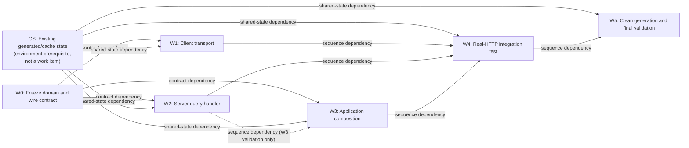

# dddart Agent Parallelism Experiment 001 — Results

> **Historical baseline.** This report records repository behavior observed on
> 2026-08-06. Subsequent work removed `QueryableRepository` and `getAllItems`,
> made `CrudResource` JSON-only with one serializer, and introduced the shared
> workspace/example validation inventory. The preserved runnable harness has
> been adapted to current `main`; historical measurements and observations below
> intentionally retain the original terminology.

Date: 2026-08-06

Experiment objective: **maximize safe independent change**

Result: **the feature decomposed into three theoretically parallel implementation tasks, but only one initial task—the server handler—could complete its declared worker-local gate without another implementation appearing or shared state changing. None could establish the cross-boundary behavior alone.**

## Executive Result

The selected feature slice was implemented and validated in the prepared workspace: `ProductRepository.findByPriceRange` now executes one default page end to end against a real `dddart_rest` server. The focused five-record HTTP test passes, all 109 existing `dddart_repository_rest` tests pass, and the new source files pass focused analysis and formatting. This is not a clean-checkout or unbounded-result claim: generated parts remain ignored, and `CrudResource` limits an unpaginated request to 50 results by default.

The implementation itself was small. The coordination burden was not.

The dominant constraint was the absence of an executable query contract connecting a domain repository method, its HTTP representation, `CrudResource` dispatch, pagination, and response shape. Before workers could be dispatched, the orchestrator had to invent and freeze the wire contract `priceRange=<min>,<max>`. The existing client used two parameters, while `CrudResource` rejects more than one non-pagination filter.

The next constraints were source and build topology:

- The repository interface, aggregate, generator annotations, `part` directive, and concrete REST client all occupy [one source library](../../packages/dddart_repository_rest/example/lib/product.dart).
- Generated transport helpers are Dart library-private rather than a public extension contract. Reusing them keeps the concrete client in that library; an external-library subclass is possible only by retaining or duplicating its own connection, serializer, URI, and error-mapping context.
- Generated files are ignored, builder fragments share `.dart_tool/build`, and the example-local generation command reported success while deleting and failing to recreate `product.g.dart`.
- The example package is a workspace member but is absent from both the local all-package script and CI package matrix.

The experiment therefore supports the hypothesis only partially: dddart's CRUD, serialization, repository, and dependency-injection contracts permit useful local separation, but cross-boundary feature contracts and validation are not yet sufficient to make this feature parallel by construction.

## Method and Scope

Read-only reconnaissance covered the workspace/package graph, public contracts, generators, composition, tests, generated artifacts, package inventories, and shared state. It was intentionally not a general architecture review.

After selecting the feature, three isolated workers were dispatched concurrently with:

- one bounded task specification;
- the relevant public or explicitly supplied contracts;
- a strict file ownership boundary;
- a requirement to report every boundary escape and validation dependency.

A fourth worker performed integration without permission to repair worker-owned source. Reconciliation occurred only after the first integration failure had been recorded. No framework redesign was made.

## Feature

### Feature tested

Complete the included Product example so this domain method works through the actual server and generated client stack:

```dart
Future<List<Product>> findByPriceRange(double minPrice, double maxPrice);
```

The resulting request/response path is:

```text
ProductRestRepository.findByPriceRange
  -> GET /products?priceRange=<min>,<max>
  -> HttpServer route registration
  -> CrudResource.handleQuery
  -> priceRangeQueryHandler
  -> Repository<Product>
  -> ProductJsonSerializer
  -> JSON array
  -> ProductRestRepository
```

Bounds are inclusive. Filtering occurs before pagination. The server reports the pre-pagination total through `X-Total-Count`, but the existing domain method returns only `List<Product>` and its client neither sends pagination parameters nor consumes that header. `CrudResource` therefore applies its default `take` of 50 at [crud_resource.dart lines 75–77](../../packages/dddart_rest/lib/src/crud_resource.dart). The implemented and tested behavior is one default page, not a guarantee that an unbounded number of matches is returned.

### Why this was representative

The feature crosses all of these existing boundaries without requiring a redesign:

1. domain aggregate and custom repository interface;
2. generated serialization;
3. generated REST repository base;
4. custom client transport implementation;
5. generic server query handling;
6. in-memory persistence capability;
7. application composition and route registration;
8. cross-package HTTP validation.

It also began from real repository state rather than an artificial benchmark. The interface and client method already existed at [product.dart lines 13–20 and 93–120](../../packages/dddart_repository_rest/example/lib/product.dart), but the client emitted `minPrice` and `maxPrice` separately. `CrudResource` removes only `skip` and `take`, then rejects more than one remaining filter at [crud_resource.dart lines 287–349](../../packages/dddart_rest/lib/src/crud_resource.dart).

### Contract the orchestrator had to supply

The repository contained no shared artifact expressing the transport semantics. Before parallel work could begin, the orchestrator supplied this contract in each worker specification:

- domain call: `findByPriceRange(minPrice, maxPrice)`;
- bounds: inclusive;
- wire key: `priceRange`;
- wire value: `<minPrice>,<maxPrice>`;
- request: `GET /products?priceRange=<minPrice>,<maxPrice>`;
- `skip` and `take`: reserved pagination parameters;
- response: HTTP 200 with a bare JSON array of Product objects;
- non-200 response: map through the generated repository's existing error mapper.

This task-specification contract enabled the experiment, but it is not a dddart contract and cannot validate either side automatically. It also failed to settle whether the non-paginated domain signature means “all matches” or “the default page”; the composed system chose the latter through framework defaults. That gap is part of the result, not silently treated as feature completeness.

## Work Graph



The initial **authoring** set after W0 was W1, W2, and W3: all three could begin from the supplied signatures. The W2→W3 sequence edge is validation-only—W3 could be written from W0, but its analyzer could not resolve the handler until W2 existed. Thus the reported theoretical value of three is start overlap, as the experiment asks, not the maximum ready-set width of a conventional finish-to-start DAG. If every edge is instead interpreted as start-blocking, that width is two. `GS` records a prerequisite that the initial checkout happened to satisfy: all three imported the `product.dart` library and therefore depended on ignored generated output and shared build state. It is shown explicitly because clean generation later proved that state was not reproducible from the nested example. It is an environment state node, not a seventh work item.

## Work Items

| ID | Objective | Inputs/contracts | Outputs/contracts provided | Expected ownership | Completion validation | Dependencies |
|---|---|---|---|---|---|---|
| W0 | Make the feature assignable by freezing behavior and HTTP representation. | Existing `ProductRepository` method; `QueryHandler`; observed single-filter behavior in `CrudResource`. | Inclusive range semantics and the `priceRange=<min>,<max>` wire contract. | Orchestrator task specifications and this report; no framework source. | Check that client, server, composition, and E2E specifications use the identical key, encoding, and inclusivity. | None. The need for W0 is itself a **Missing Contract** finding. |
| W1 | Implement the REST client request and response decoding. | W0; `ProductRepository`; generated-base member names; `RestConnection.client`; JSON-array response. | `ProductRestRepository.findByPriceRange` conforming to W0. | Only the method body in [product.dart lines 93–120](../../packages/dddart_repository_rest/example/lib/product.dart). | Focused format and analysis of `lib/product.dart`; later real-HTTP proof in W4. | W0 **contract dependency**; generated-base internals are an **implementation dependency**; GS is a **shared-state dependency**. |
| W2 | Implement inclusive server-side filtering and pagination. | W0; `Product.price`; `Repository<T>`; `QueryHandler<T>`; `getAllItems`. | `priceRangeQueryHandler` with pre-pagination `totalCount`. | New [product_query_handler.dart](../../packages/dddart_repository_rest/example/lib/product_query_handler.dart). | Focused format/analysis; behavior exercised through W4. | W0 and Product/REST public types are **contract dependencies**; GS is a **shared-state dependency**. Import naming required an undeclared package-layout convention. |
| W3 | Compose a runnable Product server using existing public APIs. | W0; `Product`, `ProductJsonSerializer`, `priceRangeQueryHandler` signature, `InMemoryRepository`, `CrudResource`, `HttpServer`. | Runnable [product_price_range_server_example.dart](../../packages/dddart_repository_rest/example/product_price_range_server_example.dart). | Only the new bootstrap file. | Focused format/analysis. Runtime filtering is not independently provable. | W0 is a **contract dependency**; W2 is a **sequence dependency** for compilation; GS is a **shared-state dependency**. |
| W4 | Prove the client/server composition through real HTTP. | Outputs of W1–W3; generated Product code; server lifecycle and client disposal contracts. | Real-HTTP [product_price_range_e2e_test.dart](../../packages/dddart_repository_rest/example/test/product_price_range_e2e_test.dart) and a `test` dev dependency. | New test plus [example/pubspec.yaml](../../packages/dddart_repository_rest/example/pubspec.yaml). | Run the exact test; verify both inclusive boundaries and exclusion of outside values. | W1–W3 are **sequence dependencies**; GS is a **shared-state dependency**. Server port discovery introduced an **implementation dependency** on `HttpServer`. |
| W5 | Verify clean generation and regressions. | W1–W4; builder manifests; ignored/generated output rules; package test commands. | Validation evidence and restored generated parts; no new framework capability. | `.dart_tool/build` and ignored `*.g.dart` state, then this report. | Build runner, focused E2E test, 109 package tests, analysis, and formatting. | W4 is a **sequence dependency**; GS is a **shared-state dependency**. |

### Why the graph was not decomposed more finely

The current client transport cannot be naturally split while reusing its generated-base access because `_connection`, `_serializer`, `_resourcePath`, and `_mapHttpException` are library-private. An external subclass could retain or duplicate equivalent state, but the framework supplies no public extension context for doing so. The aggregate, interface, annotations, `part`, and concrete client are also physically co-located. A separate domain-contract worker would have edited the same file as W1, creating artificial parallelism and a predictable Git collision.

W2's unit test could have been a separate task, but the example initially had no `test` dependency and any executable test compiles the imported `product.dart` library and its generated part. Moving that validation earlier would not create independence; it would merely move W4's sequence and shared-state dependencies into another task.

## Worker Table

| Worker | Task | Contracts Used | Expected Ownership | Boundary Escapes | Validation | Result |
|---|---|---|---|---|---|---|
| O | W0: contract freeze | `ProductRepository`, `QueryHandler`, `CrudResource` behavior | Task specifications only | Had to inspect client and server implementations because no query-schema artifact connected them. | Cross-check all worker specifications. | Enabled dispatch, but demonstrated a missing framework contract. |
| C | W1: client transport | W0; generated-base member names; `RestConnection.client` | `findByPriceRange` method body only | None outside its allowed files. The same allowed source still exposed unrelated domain and client code. | Format passed. File analysis could not pass because untouched `findByCategory` used nonexistent `httpClient`; the changed method itself had no diagnostic. | Implementation completed; independent proof failed. |
| S | W2: server handler | W0; `Repository<Product>`; `QueryResult`; `getAllItems` | New handler file only | Read `example/pubspec.yaml` to discover the package import URI. Reading Product necessarily exposed the client implementation in the same file. | Focused format and analysis passed. | Completed independently at file-analysis level. Runtime behavior waited for W4. |
| A | W3: application composition | W0; public DDD/REST APIs; handler signature | New server bootstrap only | Repository file listing, an irrelevant client-side example, and the full Product source. The latter exposed W1's method despite not being needed. | Focused format and analysis passed once the concurrently created handler existed. | Could be authored from contracts, but compile validation had a timing/sequence dependency on W2. |
| I | W4: E2E validation | Combined W1–W3 outputs; public lifecycle APIs | Test file and example pubspec | Read `HttpServer` implementation, REST test helpers, and an existing integration-test setup to discover port/lifecycle behavior. | First run failed at compile time on unrelated `findByCategory.httpClient`. After documented reconciliation, the test passed. | Integration was not mechanical. |
| V | W5: generation/regression | Builder manifests, ignored-output rules, package commands | Generated/cache state and report | Had to leave the example package and invoke build_runner from its parent package. | Parent generation passed; E2E passed; 109 package tests passed; focused analysis/format passed. | Example-local clean generation remained broken and was not redesigned. |

## Parallelism

### Theoretical concurrency

**3 workers.** W1, W2, and W3 had disjoint intended output files/regions and could begin as soon as W0 published the task-level contract.

### Practical concurrency under today's architecture

**1 worker at the initial practical frontier: W2, the server handler.**

This number counts a work item as practically assignable when its worker can implement it and pass the completion gate declared at dispatch without another worker's implementation appearing, an unrelated source repair, or a mutation of shared generated state. W2 establishes the value: its new file passed focused format and static analysis while W1 and W3 were still independent assignments.

- W1 could author its method but could not make its owned source library pass analysis because an unrelated method in the same file used a stale API.
- W2 passed its declared worker-local focused checks. Its behavior was not independently contract-tested; runtime proof still waited for W4.
- W3 could be authored from the supplied signature but could compile only after W2's file appeared.

A relaxed “code authoring only” interpretation would allow two workers (W1 and W2) to make useful progress. Conversely, if “provable” requires isolated behavioral proof rather than the declared worker-local static gate, the number is **zero**: no initial task had a contract test that could prove client/server compatibility alone. The reported baseline of one is therefore an optimistic practical count, not a claim of behavioral independence.

### Why the two numbers differ

Theoretical parallelism follows text ownership. Practical parallelism follows contracts, build state, and proof. dddart currently separates enough files to author changes concurrently, but the query wire shape, generated extension surface, generated artifacts, and executable validation chain are not independently available.

## Collisions

Five collision records are included in the baseline metric.

| ID | Type | Encountered or predicted | Evidence | Effect |
|---|---|---|---|---|
| C1 | **Contract + semantic collision** | Encountered in pre-existing code | The client encoded `minPrice` and `maxPrice` as two filters, while `CrudResource` rejects multiple filters at [crud_resource.dart lines 321–330](../../packages/dddart_rest/lib/src/crud_resource.dart). The Dart method signature says nothing about HTTP encoding, inclusivity, pagination, malformed input, or response metadata. | Required W0 to invent `priceRange=<min>,<max>` before workers could proceed. Without that intervention, independently reasonable client and server implementations were incompatible. |
| C2 | **Git collision surface + excessive context** | Predicted text collision; observed context leak | [product.dart](../../packages/dddart_repository_rest/example/lib/product.dart) contains the repository interface, aggregate, generator annotations, generated-part directive, and concrete client. Both non-client workers had to read it to obtain `Product` and were exposed to W1's implementation. | Natural domain/client decomposition converges on one file. This run avoided an actual merge conflict only by assigning the entire existing file to W1 and leaving the domain shape unchanged. |
| C3 | **Integration collision** | Encountered | The combined test did not compile because unrelated `findByCategory` called `_connection.httpClient`, while the current public getter is `client` at [rest_connection.dart line 102](../../packages/dddart_repository_rest/lib/src/connection/rest_connection.dart). | Required repair R1 outside W1's method boundary. A feature worker could not prove its own change while preserving scope. |
| C4 | **Integration + shared-state collision** | Encountered | Running `build_runner build --delete-conflicting-outputs` in the example reported success, warned that `dddart_json:serializable` was unknown, emitted generator fragments, deleted `product.g.dart`, and did not combine a replacement. The example config uses the wrong builder name at [example/build.yaml line 4](../../packages/dddart_repository_rest/example/build.yaml); the declared builder is `dddart_json:json_serializable` at [dddart_json/build.yaml lines 4–12](../../packages/dddart_json/build.yaml). | Required repair R2: rerun filtered generation from the parent `dddart_repository_rest` package. Clean-checkout validation is not discoverable or mechanically local. |
| C5 | **Integration/validation collision** | Encountered | `HttpServer(port: 0)` binds an ephemeral port internally but exposes only the requested `port`; the bound `io.HttpServer` remains private at [http_server.dart lines 42–43 and 110–175](../../packages/dddart_rest/lib/src/http_server.dart). | Required integration adaptation A1: claim and release a loopback socket, then rebind. This avoids a fixed shared port but introduces a small race and implementation knowledge. |

No actual Git merge conflict occurred: ownership was deliberately partitioned. That success should not be mistaken for architectural independence; C2 shows the natural hotspot that the assignment strategy avoided.

Malformed-range handling remains an unproved feature contract within C1. W2 throws `FormatException`; the current `CrudResource` catches it and the default `ErrorMapper` maps it to HTTP 400 at [crud_resource.dart lines 362–363](../../packages/dddart_rest/lib/src/crud_resource.dart) and [error_mapper.dart lines 58–63](../../packages/dddart_rest/lib/src/error_mapper.dart). That convention and the client-visible exception mapping are neither declared by the Product query contract nor exercised by its E2E test.

## Undocumented Cross-Boundary Assumptions

The metric counts these nine assumptions, each of which affected the selected feature:

1. A multi-value domain query must be packed into one non-pagination query key because `CrudResource` dispatches on exactly one filter key.
2. The key name, comma delimiter, bound order, and inclusive semantics are not represented in `ProductRepository`, `QueryHandler`, an annotation, or generated metadata.
3. A successful custom repository query receives a bare JSON array, not an envelope.
4. `QueryResult.totalCount` becomes an `X-Total-Count` header, but `findByPriceRange` has no return type that can preserve it.
5. A custom repository that reuses the generated connection, serializer, resource path, and error mapper must live in the same Dart library because those extension points are private identifiers; an external subclass must retain or duplicate that context.
6. The correct connection transport getter is `client`; existing example code and comments had drifted to `httpClient`/“protected” terminology.
7. Serializer and repository type names (`ProductJsonSerializer`, `ProductRestRepositoryBase`) and the presence of `product.g.dart` are naming/build conventions rather than checked source contracts.
8. For this nested workspace example, usable combined generation must be invoked from the parent package despite the example declaring `build_runner` and its own `build.yaml`.
9. Workspace membership does not imply validation coverage: the example is in [root pubspec.yaml line 20](../../pubspec.yaml), but neither [scripts/test-all.sh lines 61–77](../../scripts/test-all.sh) nor [the CI matrix lines 45–61](../../.github/workflows/test.yml) includes it.

## Shared Modification Points

The baseline counts **two execution-affecting shared modification points** encountered or predicted for the decomposed feature:

1. `example/lib/product.dart` — W1 owned the client method, reconciliation R1 touched another method, and a natural domain/client split would put multiple workers in the same interface/aggregate/annotation/part/client library.
2. `example/lib/product.g.dart` plus package `.dart_tool/build` — W1–W4 compiled against the same ignored generated part, while W5 mutated the combined output and shared generator cache.

Four additional central coordination surfaces matter for durable productization but are **not** included in the baseline because this run neither assigned them to multiple workers nor modified them: `example/pubspec.yaml` (solely W4-owned here), the new application bootstrap (solely W3-owned), `scripts/test-all.sh`, and `.github/workflows/test.yml`. The latter two would need edits to make ordinary local/CI gates cover the example. Public barrels were also inspected, but this feature added no package-public framework API.

## Validation

### Results

| Validation | Result | What it proves or fails to prove |
|---|---|---|
| `dart test test/product_price_range_e2e_test.dart` in the example | **Pass, 1 test** after R1 and generated output restoration | Real HTTP route registration, query dispatch, inclusive filtering, serialization, client decoding, and cleanup compose for a five-record default page in the prepared workspace. It does not prove behavior beyond the default 50-result limit. |
| `dart test` in `packages/dddart_repository_rest` | **Pass, 109 tests** | No regression in the package's existing unit/property/integration suite. It does not include the nested example test. |
| Focused analysis of handler, server example, and E2E test | **Pass** | New files are statically valid in the prepared workspace. |
| Focused analysis of `product.dart` | **No errors; 2 pre-existing lint infos** | Both stale client getter errors are gone. Generated code causes/reveals existing redundant-default infos. |
| Format check of four changed Dart files | **Pass** | Changed Dart source is formatted. |
| Example-wide `dart analyze --fatal-infos` | **Fail: 2 unrelated existing errors and 2 generated warnings** | A worker cannot use the package's broad analyzer as an independent completion gate. Errors are in `authentication_example.dart` and `error_handling_example.dart`; they were not repaired. |
| Build runner from nested example with `--delete-conflicting-outputs` | **Command reports success, usable output fails** | Generator fragments can be emitted, but the combined source output is absent. Success exit status is not an executable contract. |
| Filtered build runner from parent package | **Pass; restores Product/User generated parts** | A non-obvious parent-package invocation can prepare the current workspace. It is an integration repair, not an architectural fix. |

### Generation commands and reproducibility limit

The generation commands used were:

```sh
# From packages/dddart_repository_rest/example — exited successfully but
# warned about unknown dddart_json:serializable and left product.g.dart absent.
dart run build_runner build --delete-conflicting-outputs

# From packages/dddart_repository_rest — restored the two ignored combined parts.
dart run build_runner build --delete-conflicting-outputs \
  --build-filter=example/lib/product.g.dart
dart run build_runner build --delete-conflicting-outputs \
  --build-filter=example/lib/user.g.dart
```

The first outcome and subsequent file-presence checks were observed in the experiment terminal; no separate build log was checked in. Because `*.g.dart` and `.dart_tool` are ignored, the passing test result applies to the prepared workspace state after the parent-package commands. A clean checkout using only the nested example's advertised configuration is **not** reproducible today.

### Contract-test availability

Useful behavioral contracts exist for CRUD, serializers, and query callback signatures, but there is no shared client/server conformance test for a custom repository query.

The repository generator's test named “generated code compiles” does not compile its output. It checks substrings, malformed token patterns, and balanced braces at [generator_property_test.dart lines 27–96](../../packages/dddart_repository_rest/test/generator_property_test.dart). The clean-generation failure therefore passed the existing generator suite.

### Unrelated systems and tests

This chosen feature required no database service. `InMemoryRepository<Product>` is instance-local and implements `QueryableRepository`, which was a strong enabling contract.

The worker still needed unrelated code in the same example library to compile and unrelated example files prevented broad analysis. The local full-repository and CI scripts also do not run the nested example test, so ordinary green validation would not establish feature completion.

## Failure Taxonomy

| ID | Category | Obstacle | Consequence |
|---|---|---|---|
| F1 | **Missing Contract** | No shared query schema connects `ProductRepository` to HTTP key/value encoding, pagination, errors, and response metadata. | Orchestrator design was required before parallel dispatch. |
| F2 | **Non-Executable Contract** | The Dart method and `QueryHandler` callback compile independently but cannot validate that client and server agree. | Existing client and server assumptions were incompatible. |
| F3 | **Missing Boundary** | Domain contract, aggregate, annotations, generated part, and client implementation share `product.dart`. | Context leaks and natural Git collision surface. |
| F4 | **Hidden Dependency** | Generated repository transport helpers are private; reusing them requires same-library placement, while an external subclass must retain or duplicate equivalent context. | Client worker depends on generator implementation and source topology. |
| F5 | **Excessive Context** | Workers needing only `Product.price` had to read a file containing the client implementation. | Isolation instructions could not be enforced by repository structure. |
| F6 | **Validation Coupling** | W1's file and W2's executable tests compiled unrelated stale `findByCategory`. | Owned work could not be independently proven. |
| F7 | **Shared Modification Point** | Multiple generators combine into an ignored `.g.dart` and share `.dart_tool/build`. | Build execution is unsafe as an independent same-worktree activity. |
| F8 | **Hidden Dependency** | Correct generation depended on parent-package working directory and builder-name details. | Example-local success was false confidence; integration repair required repository exploration. |
| F9 | **Validation Coupling** | `HttpServer` does not expose the actual ephemeral bound port. | E2E validation required a racy socket workaround or a fixed shared port. |
| F10 | **Shared Modification Point** | Workspace, local-test, and CI package inventories are separate lists. | A feature can be in the workspace and remain unvalidated by normal gates. |
| F11 | **Integration Ambiguity / Framework Limitation** | Query parsing failures have no Product-level client/server error contract. The current default path maps `FormatException` to 400, but that is an undeclared framework convention and is not feature-tested. | A custom mapper, different exception, or client expectation can still change the composed behavior without contract failure. |

No qualitatively new failure category was required beyond the supplied taxonomy.

## Baseline Metrics

These values are scoped to this feature and use the numbered ledgers above; they are not absolute framework metrics.

| Metric | Baseline | Counting rule |
|---|---:|---|
| Total work items | **6** | W0–W5, including the necessary contract-publication and clean-generation activities. |
| Maximum theoretical concurrent workers | **3** | W1, W2, and W3 could begin authoring from W0. This is start overlap; with the W2→W3 validation-only edge treated as start-blocking, conventional DAG width is 2. |
| Maximum practical concurrent workers | **1** | W2 was the only initial work item that passed its declared worker-local completion gate without another implementation appearing or shared-state mutation. Requiring isolated behavioral proof would reduce this to zero. |
| Worker collisions | **5** | C1–C5, including encountered and predicted collision surfaces that materially affected assignment/integration. |
| Undocumented cross-boundary assumptions | **9** | The nine enumerated assumptions in the selected feature path. |
| Shared modification points | **2** | The two execution-affecting source/build artifacts enumerated above; four broader central surfaces are reported separately and excluded. |
| Integration repairs required | **2** | Post-combination corrective actions: R1 stale getter and R2 parent-package generation reroute. The ephemeral-port design is counted separately as adaptation A1. |

## What dddart Already Gets Right

1. **The core repository contract is explicit and small.** `Repository<T>` defines get/save/delete and documents not-found and upsert semantics at [repository.dart lines 176–265](../../packages/dddart/lib/src/repository.dart). The feature did not need persistence implementation knowledge for CRUD behavior.

2. **Enumeration is an explicit capability.** `QueryableRepository<T>` separately declares `getAll` at [queryable_repository.dart lines 36–46](../../packages/dddart/lib/src/queryable_repository.dart). The server worker could call `getAllItems` and fail explicitly for an unsupported repository instead of assuming every backend can enumerate.

3. **The in-memory implementation is isolated and useful.** Each `InMemoryRepository` instance owns its map and implements `QueryableRepository` at [in_memory_repository.dart lines 102–158](../../packages/dddart/lib/src/in_memory_repository.dart). No database or shared external state was needed for this experiment.

4. **Serialization is behind interfaces.** `Serializer<T>` and `JsonSerializer<T>` provide typed seams at [serialization_contracts.dart lines 1–30](../../packages/dddart_serialization/lib/src/serialization_contracts.dart) and [json_serializer.dart lines 4–65](../../packages/dddart_json/lib/src/json_serializer.dart). `CrudResource` did not depend on the Product generator implementation.

5. **Server behavior is constructor-composed.** `CrudResource` accepts repository, serializer, and query-handler maps; `HttpServer.registerResource` takes the composed resource. There is no process-global service locator. W2 and W3 could own different files until final composition.

6. **HTTP transport is injectable.** `RestConnection` exposes an `http.Client`, and the broader package already uses mock/test clients. The selected E2E test chose real HTTP to exercise integration, but narrower client tests are possible.

7. **Generated bases preserve domain-specific interfaces.** The REST generator discovers custom interface methods and emits an abstract base at [rest_repository_generator.dart lines 270–340](../../packages/dddart_repository_rest/lib/src/generators/rest_repository_generator.dart). CRUD generation and custom query logic remained conceptually separate.

8. **Package boundaries are explicit.** Workspace membership and per-package dependencies are declared in pubspec files. Existing package tests can run narrowly, and CI already demonstrates package-level matrix parallelism for the packages it lists.

## What Prevents Greater Parallelism

Ranked by impact on safe concurrent development for this feature:

### 1. No executable cross-boundary query contract

This forced the orchestrator to choose the key, encoding, inclusivity, pagination relationship, response shape, and errors. It directly caused C1 and limits both decomposition and mechanical integration.

### 2. Private generated helpers pull ownership toward the aggregate library

The generator's reusable transport members are private identifiers. The current implementation therefore converges with the interface, model, annotations, and generated part in `product.dart`; moving it out would require duplicate connection/serialization/error state. This creates a Git hotspot and defeats low-context extension even though external subclassing is technically possible.

### 3. Code generation is shared, ignored, and working-directory-sensitive

Source workers depend on artifacts that are absent from Git. Generator workers share caches and combined output. A successful command can leave the package uncompilable. This is both shared state and a hidden sequence dependency.

### 4. Validation topology does not match workspace topology

The selected example is a workspace package but not an ordinary local/CI validation target. Focused checks work, while broad checks fail on unrelated example drift. Workers cannot select a single authoritative completion gate.

### 5. Composition is local but final registration and test lifecycle are manual

Constructor injection is positive, but all resources still converge on a composition root, route names are strings, and the bound HTTP endpoint is not exposed for isolated tests.

### 6. Generator tests prove text shape rather than executable composition

String-based generator tests did not detect the builder/config/combining failure. Independently valid fragments did not establish a usable generated library.

## Framework Opportunities

These are the smallest framework-level capabilities suggested by the experiment. None was implemented.

| Limitation | Smallest useful capability |
|---|---|
| Missing client/server query contract | Add a typed/declarative query descriptor that owns domain arguments, wire key/value encoding, server parsing, pagination policy, result metadata, and error semantics. Generate or share both client and `CrudResource` adapters from that descriptor. |
| Private generated transport helpers | Replace private-member reuse with a public, narrow `RestRepositoryContext<T>`/query transport object exposing request execution, resource URI building, serializer, and error mapping. Custom query implementations could then live in separate libraries without duplicating that state. |
| Shared and ambiguous generation | Provide one canonical workspace-aware generation command/manifest with isolated per-package build state, correct builder IDs, deterministic outputs, and an executable compile check. Either track required generated sources or make clean generation an enforced prerequisite everywhere. |
| Duplicated validation inventories | Derive local and CI package matrices from workspace membership plus per-package validation metadata. Permit explicit opt-outs instead of silent omission. |
| Weak example validation | Give every workspace example an ordinary focused test target and include it in the generated validation matrix. Keep unrelated examples in separate packages or targets so one stale example cannot invalidate all others. |
| Central/manual route composition | Define a small public resource-registration value that owns the route name and resource/handler, so a feature module can export one registration unit and the application root can mechanically compose and duplicate-check a list. |
| HTTP lifecycle/port ambiguity | Have `HttpServer.start()` return a bound-server handle or expose `boundPort`/`handler`, enabling port `0` without implementation inspection or socket races. |
| Non-executable generator contract | Add builder-pipeline tests that run both generators, combine the parts, and compile/import the produced library rather than only inspecting strings. |

## Required Questions

### A. Decomposition

**Could the feature be expressed naturally as independent work?**

Partly. Client transport, server filtering, and application composition were sensible distinct activities with disjoint intended outputs. A separate real-HTTP validation task was also natural.

**What prevented finer decomposition?**

The domain interface, aggregate, annotations, generated-part directive, and current client implementation share one Dart library. Generated transport helpers are private to that library. Splitting domain, generator configuration, and custom client further would assign the same file or require an external subclass to recreate implementation context.

### B. Context

**How much repository context did workers need?**

W1 needed one aggregate/client library and the connection contract. W2 needed the Product type and two REST query contracts. W3 needed public composition APIs. W4 needed all feature outputs plus server lifecycle behavior. W5 had to understand nested workspace generation, builder manifests, ignores, local test scripts, and CI.

**Could workers discover everything from explicit contracts?**

No. W0 itself required comparing client and server implementations. W2 needed a pubspec to discover the import URI. W4 needed framework implementation/test examples to discover ephemeral-port behavior. W5 needed parent-package exploration to find a generation path that produced a usable part.

**What was implicit?**

The nine assumptions enumerated above: most importantly the wire query schema, the same-library requirement for reusing private helpers, generated names/presence, generation working directory, and validation coverage.

### C. Contracts

**Which existing contracts enabled independence?**

`Repository<T>`, `QueryableRepository<T>`, `Serializer<T>`, `JsonSerializer<T>`, `QueryHandler<T>`, `QueryResult<T>`, `InMemoryRepository<T>`, `CrudResource`, and `RestConnection.client` all provided useful typed seams.

**Which were insufficient?**

`ProductRepository.findByPriceRange` specifies domain arguments but not transport, pagination completeness, or errors. `QueryHandler<T>` specifies an in-process callback but not a remotely consumable query schema. The generated base exposes a public subclass/constructor seam but keeps its reusable transport context private.

**Which necessary contracts did not exist?**

A shared query descriptor/client-server conformance contract, an independently accessible generated-repository extension context, a canonical clean-generation contract, and a testable bound-server lifecycle contract.

### D. Change Locality

**Could workers change owned areas?**

W2, W3, and W4 primarily did. W1 changed only its method initially.

**Where did changes leak?**

Integration required changing unrelated `findByCategory` in W1's shared source library. Build validation changed shared ignored generated/cache state and required work from the parent package.

**Which files were hotspots?**

The two execution-affecting hotspots were `product.dart` and `product.g.dart`/`.dart_tool`. The example pubspec, bootstrap registration, and duplicated local/CI package inventories are additional central surfaces for broader productization, but were singly owned or unmodified in this run.

### E. Validation

**Could each worker prove correctness independently?**

No. W2 and W3 could establish focused static validity. W1 could not make its shared source library pass its focused gate. None of W1–W3 independently proved end-to-end semantics. W4 exposed unrelated compile failure, and W5 exposed false-success generation.

**Were contract tests available?**

Not for custom query client/server agreement. Existing generator tests validate generated text shape rather than a compiled combined artifact.

**Did unrelated systems/tests have to run?**

No external services were required. Unrelated source in the example did have to compile, and broad example analysis remained red for unrelated reasons. The full package suite passed but does not include the nested example.

### F. Integration

**How much reasoning was required after combination?**

Material reasoning was required to identify a stale connection API in an unrelated method, devise the integration-only ephemeral-port adaptation, distinguish successful fragment generation from missing combined output, and discover that parent-package filtered generation restores the required parts.

**Could integration have been mechanical?**

No. Two post-combination repairs were required: R1 changed the stale getter and R2 rerouted generation through the parent package. In addition, integration required adaptation A1 for ephemeral-port discovery. A1 and R2 depended on information absent from worker contracts.

### G. Parallelism

- total work items: **6**;
- maximum theoretical concurrent workers: **3** for simultaneous authoring starts (**2** if all graph edges are treated as start-blocking);
- maximum practical concurrent workers: **1**;
- worker collisions: **5**;
- undocumented cross-boundary assumptions: **9**;
- shared modification points: **2** execution-affecting points, plus **4** broader central coordination surfaces excluded by the stated counting rule;
- integration repairs: **2**, plus **1** integration-only adaptation.

## Conclusion

> **If this feature were assigned to autonomous workers by an orchestration system today, what would prevent us from safely adding more workers?**

The limiting factor would not be a shortage of files to assign. It would be the absence of shared, executable contracts and independently reproducible proof.

An orchestrator must currently decide the client/server query protocol and result-completeness semantics, know that reusing generated “protected” transport members requires same-library placement, schedule or pre-provision ignored generated artifacts, avoid concurrent build state, account for validation inventories that omit workspace members, and perform integration reasoning around server lifecycle and stale co-located code. Adding more workers would increase the number of independently reasonable assumptions and shared-state interactions faster than it would increase safely completed work.

For this feature, dddart permits parallel authoring, but not yet parallel completion by construction.
