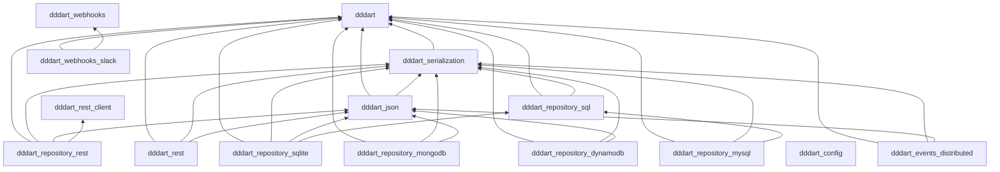

# dddart framework map

This is the canonical orientation map for the current dddart repository. Use it
to find the package and contract that own a change; use
[`CONTRIBUTING.md`](../CONTRIBUTING.md) for the development workflow and
[`AGENTS.md`](../AGENTS.md) for agent operating rules.

This map describes implemented behavior, not proposals. The root
[`pubspec.yaml`](../pubspec.yaml) is authoritative for workspace membership, and
exported source, generator configuration, and executable tests remain
authoritative for exact APIs. If this map disagrees with them, fix the map or
escalate the ambiguity rather than inventing a convention.

## Package relationships

Arrows point from a consuming package to its direct dddart workspace dependency.
External pub dependencies are omitted.

### Package roles

| Package | Role |
|---|---|
| `dddart` | Domain primitives, aggregate and event infrastructure, repository contracts, and `InMemoryRepository`. |
| `dddart_serialization` | Serialization contracts and annotations shared by formats and generators. |
| `dddart_json` | JSON serializer generation for serializable aggregate roots, nested entities, and values. |
| `dddart_rest` | Shelf-based server resources, query handling, authentication/authorization hooks, JWT claims generation, and server composition. |
| `dddart_rest_client` | Standalone authenticated HTTP-client support. It does not depend on the dddart domain packages. |
| `dddart_repository_rest` | Generated client-side CRUD repositories over `RestConnection`; it does not provide the REST server resource. |
| `dddart_repository_sql` | Shared SQL annotations and generator support. It is infrastructure, not a concrete repository backend. |
| `dddart_repository_sqlite` | Generated SQLite repository implementation. |
| `dddart_repository_mysql` | Generated MySQL repository implementation. |
| `dddart_repository_mongodb` | Generated MongoDB repository implementation. |
| `dddart_repository_dynamodb` | Generated DynamoDB repository implementation and table-description support. |
| `dddart_config` | Standalone YAML/environment configuration loading. |
| `dddart_webhooks` | Generic Shelf webhook verification, deserialization, dispatch, and response pipeline. |
| `dddart_webhooks_slack` | Slack request verification and payload support built on `dddart_webhooks`. |
| `dddart_events_distributed` | Experimental HTTP polling support for distributed domain events, with an event-repository contract and in-memory implementation but no durable backend. |

## Core contract boundaries

- `AggregateRoot` is the persistence boundary. A repository manages aggregate
  roots, not nested entities introduced merely to divide implementation work.
- `Repository<T>` is the minimum CRUD contract: `getById`, `save`, and
  `deleteById`. `getById` returns `T` and reports absence with a
  `RepositoryException`; it is not a nullable lookup.
- Collection reads are explicit application contracts rather than a universal
  repository capability. Define selection, ordering, pagination, total-count,
  and continuation semantics in a domain-specific read interface.
- `Serializer<T>` is the format-neutral serialization seam.
  `JsonSerializer<T>` is the JSON-specific seam; `dddart_json` generates its
  aggregate-specific implementations.
- Domain-specific repository interfaces may extend the base repository
  contracts with query methods. Consumers should depend on that interface, not
  on a generated backend class.
- `EventBus` is the in-process event seam. `dddart_events_distributed` adds a
  separate transport/storage workflow; it is not a transparent replacement.

### Repository capability matrix

| Implementation or contract | CRUD | Collection reads | Important boundary |
|---|:---:|---|---|
| `Repository<T>` | Yes | None | Use when CRUD is sufficient. |
| `InMemoryRepository<T>` | Yes | Concrete `getAll`/`getAllSync` conveniences | Instance-local test/prototype fake; it does not nominally implement a custom domain read interface. |
| Generated MongoDB repository | Yes | Custom interface only | Default generated class implements `Repository<T>`. |
| Generated DynamoDB repository | Yes | Custom interface only | No implicit full-table scan is generated. Define bounded domain reads or an explicit scan contract. |
| Generated REST repository | Yes | Handwritten custom interface | Client-side HTTP transport; custom queries are not inferred from a method signature. |
| Generated SQLite repository | Yes | Custom interface only | Default generated class implements `Repository<T>`. |
| Generated MySQL repository | Yes | Custom interface only | Default generated class implements `Repository<T>`. |
| `dddart_repository_sql` | N/A | N/A | Shared generator infrastructure; no concrete repository is generated by this package alone. |

When a backend annotation names a custom interface with methods beyond base
CRUD, the generator emits an abstract `<Aggregate><Backend>RepositoryBase`.
That base supplies CRUD and leaves the additional methods abstract. Its
underscore-prefixed connection and serializer fields are Dart library-private,
not subclass-protected; an implementation that uses them must be in the same
library, commonly through a handwritten `part`.

The generated base implements the named interface. For consumer tests of custom
read interfaces, write a focused fake or an in-memory adapter rather than
assigning `InMemoryRepository<T>` directly. `listPage` is a common application
method name, not a framework type or universal dddart contract.

## Generated code topology

Run builders from the consumer package or example that owns the annotated Dart
library. Most current generators use a cached shared part; SourceGen's combining
builder merges all contributions for one input library into one
`source_name.g.dart` file referenced by `part 'source_name.g.dart';`.

| Annotation or scan | Builder identifier | Cached fragment declared in `build.yaml` |
|---|---|---|
| `@Serializable()` | `dddart_json:json_serializable` | `.json_serializable.g.part` |
| `@JwtSerializable()` | `dddart_rest:jwt_claims` | `.jwt_claims.g.part` |
| `@GenerateMongoRepository()` | `dddart_repository_mongodb:mongo_repository` | `.mongo_repository.g.part` |
| `@GenerateDynamoRepository()` | `dddart_repository_dynamodb:dynamo_repository` | `.dynamo_repository.g.part` |
| `@GenerateRestRepository()` | `dddart_repository_rest:rest_repository` | `.rest_repository.g.part` |
| `@GenerateSqliteRepository()` | `dddart_repository_sqlite:sqlite_repository` | `.sqlite_repository.g.part` |
| `@GenerateMysqlRepository()` | `dddart_repository_mysql:mysql_repository` | `.mysql_repository.g.part` |
| Serializable `DomainEvent` scan | `dddart_events_distributed:event_registry` | See exception below. |

`GenerateSqlRepository` is a shared base annotation; there is no active
`dddart_repository_sql` concrete builder.

The distributed-event registry is currently unresolved: its factory uses a
`LibraryBuilder` that emits `.event_registry.g.dart`, while `build.yaml` declares
a `.event_registry.g.part` output and the combining builder. Do not rely on or
canonize automatic registry generation until those definitions and an
executable consumer test agree.

Generated `*.g.dart` files and build caches are normally ignored. Their mere
presence is not evidence that they are current. The tracked
`packages/dddart_rest/lib/src/standard_claims.g.dart` is retained for package
runtime use but remains generator-owned. Verify the owning library's `part`
directive, regenerate the outputs declared in
[`tool/validation/inventory.json`](../tool/validation/inventory.json), and
compile or test that library.

## REST and application composition

Composition is application-owned; the framework does not provide a dependency
injection container or a separate composition package. Server composition and
client transport are deliberately separate:

1. Application code chooses a `Repository<T>` implementation and one
   `JsonSerializer<T>`.
2. It creates `CrudResource<T, TClaims>` with a path, those dependencies, and
   optional authentication, authorization, query, exception, and lifecycle
   hooks.
3. It registers that resource with `HttpServer`, which installs the Shelf CRUD
   routes. Custom Shelf handlers can be added separately.
4. A client creates `RestConnection`, optionally with authentication and an
   injected `http.Client`, then constructs the generated REST repository.

`QueryHandler<T>` is an in-process server callback with five inputs: the
repository, non-pagination query parameters, `skip`, `take`, and the
authentication result. It returns `QueryResult<T>` with items and an optional
total count. It is not a shared client/server operation schema.

Current collection-query behavior is intentionally narrow:

- no filter invokes the explicitly configured `collectionHandler`, or returns
  `400` when none is configured;
- one filter key selects the handler registered for that key;
- more than one filter key returns `400`;
- pagination defaults to `skip = 0`, `take = 50`, with a default maximum of
  `100`;
- `totalCount`, when supplied, is returned in `X-Total-Count`.

Before parallel client and server work, freeze resource paths, HTTP methods,
query keys and encoding, pagination, response metadata, authentication, and
error behavior. Generated REST repositories provide CRUD only; custom query
transport remains handwritten on both sides.

Useful isolated tests are:

- an injected mock `http.Client` through `RestConnection` for client behavior;
- `InMemoryRepository<T>` for server CRUD behavior, wrapped by a focused adapter
  when a custom read interface is required;
- a focused custom-interface fake when persistence behavior is not relevant;
- direct `QueryHandler<T>` or `CrudResource.handleQuery` calls for server query
  behavior.

Stock CRUD resources are intentionally JSON-only: success bodies use JSON,
collection responses are JSON arrays, an `Accept` header that disallows JSON
returns `406`, and non-JSON POST/PUT bodies return `415`. Errors use
`application/problem+json`.

## Runtime and service boundaries

| Area | Runtime or external requirement |
|---|---|
| Core, serialization contracts, and generated JSON models | No external data service; generation requires the consumer's build toolchain. |
| `dddart_rest` and webhook packages | Server-side Shelf composition. |
| `dddart_rest_client` and `dddart_repository_rest` | HTTP client-side packages; `http.Client` is injectable for tests. |
| SQLite | Embedded database through `sqlite3`; no service container. |
| MongoDB, DynamoDB, and MySQL | Integration behavior requires the corresponding service or local emulator. |
| Distributed events | Experimental HTTP client/server flow; the application must choose an `EventRepository`, and only an in-memory implementation is bundled. |

Do not infer blanket browser compatibility from a package's domain API. The
`dddart` public barrel exports a file logger that uses `dart:io`; `dddart_config`
uses files and `Platform.environment`; and `dddart_rest_client` exports
credential-file and localhost-callback implementations. Require a compile check
for the intended target before making a platform-support claim.

Do not use an external integration test as the first proof of consumer logic
that can be tested through a repository, serializer, or HTTP-client seam.

## Workspace and examples

The root workspace currently contains 22 members: 15 framework packages and
seven example packages.

Workspace examples:

- `packages/dddart_json/example`
- `packages/dddart_rest_client/example`
- `packages/dddart_config/example`
- `packages/dddart_repository_rest/example`
- `packages/dddart_repository_sqlite/example`
- `packages/dddart_repository_mysql/example`
- `packages/dddart_events_distributed/example`

Six additional examples have their own pubspecs but are not workspace members:

- `packages/dddart/example`
- `packages/dddart_rest/example`
- `packages/dddart_repository_mongodb/example`
- `packages/dddart_repository_dynamodb/example`
- `packages/dddart_webhooks/example`
- `packages/dddart_webhooks_slack/example`

Resolve workspace examples from the repository root. Resolve standalone
examples from their own directories. Package analysis does not prove that a
nested example compiles; validate every affected example explicitly. The shared
inventory classifies each entry point as runnable, illustrative, or legacy; the
distributed-events example is currently legacy/WIP.

## Known edges to verify, not conventions to copy

- Stale example code, ignored generated output, and build cruft are not
  architectural evidence.
- `tool/validation/inventory.json` is checked against workspace membership and
  discovered examples and drives both local and CI validation.
- Repository backends differ in capabilities and generated class shape. Inspect
  the selected generator and its tests before planning against it.
- The event-registry generator mismatch remains a WIP edge. Other deferred
  limitations, including non-atomic ETag checks and read-authorization gaps, are
  tracked in [`KNOWN_FRAMEWORK_DEFECTS.md`](../KNOWN_FRAMEWORK_DEFECTS.md).
  Escalate changes to them as framework decisions rather than silently creating
  a new convention in consumer code.
